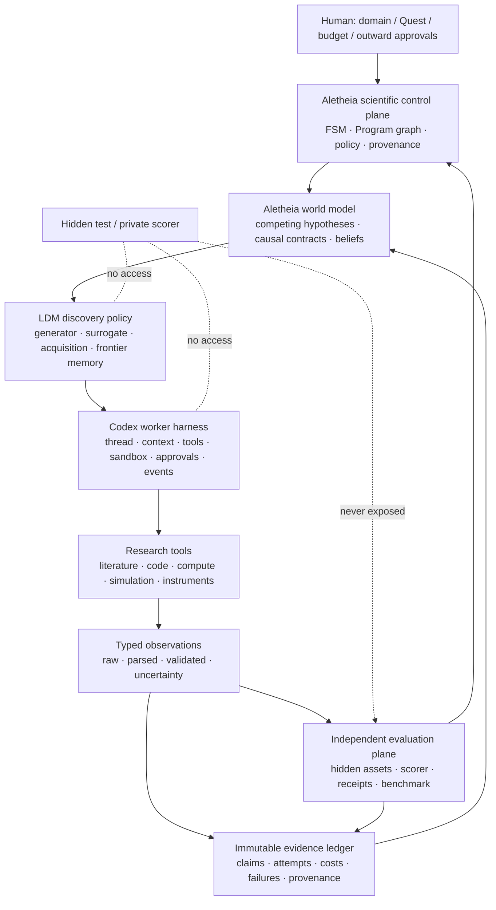

# Codex Harness × Large Discovery Model × Benchmark：Aletheia 提升方案

> **Status update (2026-08-22): supporting research only.** This document evaluates several
> optional execution/search/evaluation techniques; it must not be read as Aletheia's target module
> graph or as a plan to combine named systems. The first-principles target architecture and migration
> order are defined in
> [`END_TO_END_AUTONOMOUS_RESEARCH_ARCHITECTURE_2026_08_22.md`](END_TO_END_AUTONOMOUS_RESEARCH_ARCHITECTURE_2026_08_22.md).

日期：2026-08-21

状态：架构与评测提案，不是已实现能力或科学结果

目标：判断 Codex agent harness、Large Discovery Model（LDM）及相关 benchmark 如何把
Aletheia 从“证据约束的研究操作系统”推进到“可验证的自主探索科学家”。

## 0. 结论先行

建议引入，但必须分层引入，不能把三类系统混成一个会自我评分的超级代理：

1. **Codex harness 是执行层升级。** 它最可能改善长任务的上下文延续、工具循环、流式事件、
   中断恢复、审批和 token 效率。它不负责判断科学结论是否成立。
2. **LDM 是搜索策略升级。** 它把生成模型的候选提议能力，与从真实实验反馈拟合的概率代理模型、
   acquisition function 和持续更新的 discovery memory 结合。它最可能改善“有限实验预算下下一步试
   什么”，但 acquisition score 不是科学证据。
3. **Aletheia 必须继续拥有科学控制权。** Quest/Program/Campaign、预注册、不可变证据、独立 scorer、
   hidden assets、因果与机制门、预算和外部动作审批都不能下放给 Codex 或 LDM。
4. **相关 benchmark 应成为分层仪表盘，而不是一个总分。** 编码、复现、隐藏规律、开放方法创新、
   长时程可靠性、校准、假发现和外部复现必须分别测量。
5. **先做同模型、同预算的因果消融。** 在没有真实四轨/私有 prospective 证据前，不能声称 Codex
   harness、LDM 或组合系统已经提升了 Aletheia 的科学能力。
6. **所有 `L1`–`L4` 必须带命名空间。** PhysGym 的 L1–L4 表示逐步移除物理先验，HiSciBench
   的 L1–L5 表示从科学素养到发现的工作流层级，Aletheia F7 的 L0–L5 则是内部晋升梯度；裸写
   “达到 L4” 没有可比较含义。

推荐的目标结构不是 “Codex 替代 Aletheia”，而是：

> **Aletheia scientific control plane**
> → **LDM discovery policy**
> → **Codex worker harness**
> → tools / compute / simulation / lab
> → **independent evidence and evaluation plane**
> → Aletheia belief update。

## 1. 先统一三个容易混淆的 “harness”

| 名称 | 本文含义 | 能做什么 | 不能做什么 |
|---|---|---|---|
| Codex agent harness | 模型周围的长程执行运行时 | 线程、上下文、工具、流式事件、sandbox、审批、恢复 | 不能成为科学真值来源或给自己打分 |
| Aletheia scientific control plane | 科学任务和证据的权威状态机 | 预注册、预算、角色隔离、世界模型、实验选择、账本、门禁 | 不应依赖模型隐式记忆维持事实 |
| Aletheia evaluation harness | 与研究代理隔离的评价平面 | hidden assets、客观 scorer、签名 receipt、重放、统计决策 | 不能向候选代理泄漏答案、test 或内部得分 |

这一区分必须进入代码命名、manifest 和文档。否则 “harness score 提升” 很容易被误读为“科学能力
提升”，或者把 evaluator 的工具意外暴露给 agent harness。

## 2. Aletheia 当前基础与真正缺口

Aletheia 已经不是一个仅靠 prompt 串起来的研究代理。当前仓库已经具备：

- Claude/OpenAI provider-neutral worker 边界；
- OpenAI API 的 `Responses`、`store=false`、严格 function schema 和有界工具循环；
- ChatGPT subscription 下的官方非交互 Codex CLI transport；每次运行进入空临时目录、关闭
  Codex 内建工具，并只允许严格控制对象请求 Aletheia 本地工具；
- 确定性 FSM、跨模型评审、作者排除、hard sandbox、预算和外部动作审批；
- F7 独立 evaluator、三类公开 benchmark adapter、四臂消融、private-suite custody 和
  Frontier Gate 报告机制；
- F8 文献语料、source span、prior-art、novelty 和 protocol-safe SOTA 边界；
- F9 竞争假设、预观察预测、约束实验选择、贝叶斯更新、机制/因果和 K3 科学退出协议；
- F10 版本化能力、typed observation、材料身份、结构实验、模拟、机制 campaign 和签名晋升；
- F11 durable queue、事务科学转换、Program graph、receipt-backed memory、shadow portfolio、
  fault injection 和真实时长 endurance gate。

相关实现入口包括：

- [`ARCHITECTURE.md`](ARCHITECTURE.md)
- [`aletheia/orchestrator/codex_runtime.py`](../aletheia/orchestrator/codex_runtime.py)
- [`aletheia/orchestrator/openai_runtime.py`](../aletheia/orchestrator/openai_runtime.py)
- [`benchmarks/BASELINE_MATRIX.md`](benchmarks/BASELINE_MATRIX.md)
- [`benchmarks/FRONTIER_GATE_REPORT.md`](benchmarks/FRONTIER_GATE_REPORT.md)
- [`epistemics/CONSTRAINED_EXPERIMENT_SELECTION.md`](epistemics/CONSTRAINED_EXPERIMENT_SELECTION.md)
- [`programs/RECEIPT_BACKED_SCIENTIFIC_MEMORY.md`](programs/RECEIPT_BACKED_SCIENTIFIC_MEMORY.md)
- [`programs/RESEARCH_ENDURANCE_GATE.md`](programs/RESEARCH_ENDURANCE_GATE.md)

因此，当前缺口不是“再加一个能跑 shell 的 agent”，而是：

| 缺口 | Codex harness 能否解决 | LDM 能否解决 | 仍由 Aletheia/F12 解决 |
|---|---:|---:|---:|
| 长任务上下文和工具执行可靠性 | 主要贡献 | 间接 | 审计、恢复验收 |
| 有限预算下扩展候选空间 | 间接 | 主要贡献 | 候选合法性和预算硬门 |
| 经验反馈驱动下一轮选择 | 提供执行循环 | 主要贡献 | observation admission 和 belief ledger |
| 文献覆盖与 false novelty | 否 | 仅能消费结果 | F8 + 独立评价 |
| 假发现、校准、机制排除 | 否 | 可改善策略但不可裁决 | F7/F9 scorer |
| 真实外部复现和湿实验 | 否 | 只能选实验 | F12 Reality Bridge |
| 科学结论发布授权 | 否 | 否 | 人类和不可逆动作门 |

## 3. 推荐架构



### 3.1 权威状态边界

- Codex thread 是**工作记忆**，可压缩、丢弃和重建。
- LDM discovery memory 是**搜索状态**，只保存被 Aletheia 接纳的候选、观察和 surrogate snapshot。
- Aletheia ledger 是**科学事实来源**；模型文字、隐藏 reasoning、聊天摘要和 acquisition rationale
  都不是证据。
- independent evaluator 是**裁决来源**；它的 hidden data、scorer code、签名密钥和 test outcome
  不能进入 Codex/LDM 上下文。

### 3.2 双层循环

建议保留两个不同时间尺度：

1. **内循环：Codex harness** 在一个冻结任务内查上下文、编辑、调用工具、诊断失败和生成候选。
2. **外循环：Aletheia + LDM** 汇总已验证观察、更新 surrogate/世界模型、分配下一批实验，并决定
   keep / revert / refine / pivot / stop。

内循环不能自行打开新的确认数据、改变预注册 metric 或增加预算；外循环不能把未验证的 worker 日志
当成 observation。

## 4. Codex harness 能带来的具体提升

OpenAI 将 agent harness 定义为模型外部负责上下文、工具、事件、失败、审批和跨 turn 持续工作的
执行系统。官方公开的 Codex harness 提供 CLI、SDK 和 app-server 三种集成面；app-server 尤其适合
需要创建/恢复线程、流式事件、中断和审批的产品内 agent。

### 4.1 当前接入与目标接入的差异

| 维度 | 当前 Aletheia Codex transport | 建议 shadow target |
|---|---|---|
| 生命周期 | 每个有界工具 turn 调用一次 `codex exec` | 每个 Task/Campaign 一个可恢复 thread |
| 工具 | 内建工具关闭，只请求 Aletheia `ToolSpec` | 继续最小工具集；经 SDK/app-server 暴露 |
| 状态 | Aletheia 手工拼接 history | harness 管工作上下文，Aletheia 注入权威 state capsule |
| 流式与中断 | 以 CLI 事件规范化为主 | 原生 event/interrupt/approval 映射到 durable event ledger |
| compaction | 主要依赖 Aletheia 上下文构建 | 可试用 retained reasoning/context compaction，但必须审计覆盖 |
| sandbox | 空临时目录 + read-only + 本地工具门 | Codex sandbox 是内层；Aletheia Docker/能力策略仍是外层硬边界 |
| 恢复 | worker/任务层重试和 durable queue | thread resume 与 Aletheia lease/replay 组合，禁止重复外部动作 |

### 4.2 预期收益

1. **减少长程漂移。** 同一研究任务不必在每个工具 turn 重建全部文本状态。
2. **更细的可观测性。** thread、turn、event、tool、approval 和 interruption 可映射为 Aletheia
   的 durable events，便于定位“模型失败、工具失败、基础设施失败、科学失败”。
3. **改善故障恢复。** Codex thread 恢复负责工作上下文；Aletheia task/command ledger 负责幂等和
   科学状态，两者职责互补。
4. **降低上下文成本。** retained reasoning 和 compaction 值得测试；OpenAI 在 ARC-AGI-3 上报告过
   明显 harness 效应，但这只说明 harness 会影响代理表现，不能外推为科学发现收益。
5. **更自然的人工审批。** Codex approval request 可映射到 Aletheia 已有的 outward-action token，
   但 Codex 的“allow”不能替代 Aletheia 的权限决定。

### 4.3 必须保留的防线

- **受保护事实重注入。** 每次新 turn/compaction 后，由 Aletheia 机械注入 task-scoped、
  non-droppable facts、当前预算、数据角色、未解决 objections 和预注册 contract；然后记录覆盖 receipt。
- **摘要不改事实。** Codex 摘要只能成为可丢弃 cache，不能修改 negative result、claim strength、
  observation validity、Campaign state 或 budget。
- **审批双钥匙。** agent harness 请求动作，Aletheia policy 判定动作；不可逆动作仍需外部授权。
- **版本冻结。** model snapshot、reasoning effort、Codex harness commit/version、SDK/app-server 版本、
  system prompt、tool schema 和 sandbox policy 必须进入 system manifest。
- **隐藏 reasoning 不作证据。** 可重用 reasoning 只改善执行，不进入论文、科学 scorer 或机制证明。

### 4.4 推荐集成方式

先实现 **shadow adapter**，不直接替换当前 `codex exec` transport：

1. 保留现有 transport 作为对照和故障回退；
2. 优先试 Codex SDK；需要精确线程生命周期和审批交互时再使用 app-server；
3. 统一输出为 Aletheia 已有 `assistant_text/tool_use/tool_result/result` 事件；
4. 禁止 Codex 直接写 evaluator workspace、数据库或 outward system；
5. 通过同模型、同 prompt、同工具、同预算的 paired run 决定是否晋升。

## 5. Large Discovery Model 能带来的具体提升

### 5.1 LDM 是什么

2026-08-16 的 LDM 论文把开放发现建模为有限昂贵评价预算下的 sequential inverse design。其核心
不是一个更大的通用 LLM，而是三个反复耦合的组件：

1. **Generative foundation model**：在结构化、不可枚举空间里提出、修改和扩展候选；
2. **Probabilistic surrogate**：从已执行实验 `(candidate, observed reward)` 拟合期望与 epistemic
   uncertainty；论文实例使用 Gaussian Process；
3. **Acquisition function**：用 EI、UCB、EHVI 等把预期收益和不确定性转成“再投入计算或实验的
   决策价值”，并引导候选生成、refinement、branch expansion 和真实评价选择。

论文在神经网络训练程序、抗体 CDRH3 和分子优化三个数字评价场景中报告了相对 LLM-only/BO-only
基线的收益。这个结果值得复现，但当前版本仍是新预印本，评价均为 in-silico/digital oracle；论文也
明确列出 exact GP 三次复杂度、surrogate misspecification、reward exploitation、外部知识记忆不足和
尚未湿实验验证等局限。因此它是高价值架构假设，不是“通用自主科学家已解决”的证据。

### 5.2 与 Aletheia K3 的关系

LDM 不应替换 K3。两者解决不同层次的问题：

| 维度 | Aletheia K3 | LDM | 合并方式 |
|---|---|---|---|
| 状态对象 | 竞争科学假设、因果图、预测和 credence | 大量结构化候选及其 reward surface | 假设约束候选空间，候选反馈更新假设 |
| 不确定性 | 假设概率和观察似然 | 候选 reward 的 posterior mean/variance | 分开校准，禁止互相伪造 |
| 选择目标 | 假设区分、EIG、成本和硬约束 | acquisition-tilted candidate search | 先过科学硬门，再优化 acquisition |
| 反馈 | validated observation 后贝叶斯更新 | 每轮 empirical observation 更新 surrogate | 只消费同一 admitted observation receipt |
| 失败防线 | preregistration、alternative exclusion、revision | surrogate 校准、OOD、acquisition ablation | evaluator 分别检查 epistemic 和优化失败 |

K3 当前更像**科学解释层**；LDM 更像**开放设计空间的搜索层**。组合后，K3 回答“哪些解释仍可能
成立、什么观察最能区分”，LDM 回答“在满足这些科学约束的候选空间里，有限预算先做哪几个具体设计”。

### 5.3 建议新增的最小对象

```text
DiscoveryCandidate
  candidate_id, canonical_representation_sha256, family_id,
  proposal_parent_ids, constraints, domain_features, author_manifest_sha256

EmpiricalObjectiveContract
  objective_ids, directions, units, noise_model, validity_rules,
  measurement_protocol_sha256, evaluator_manifest_sha256

SurrogateSnapshot
  training_observation_receipts, feature/kernel/model identity,
  hyperparameters, calibration evidence, supported_region, snapshot_sha256

AcquisitionDecision
  candidate_pool_sha256, surrogate_snapshot_sha256, acquisition_kind,
  mean/uncertainty/acquisition components, selected_ids, rejected_ids,
  compute_budget, experiment_budget, rationale, decision_sha256

DiscoveryRoundReceipt
  input world_model_sha256, proposal receipt, acquisition decision,
  executed candidates, admitted observations, next snapshot, costs, failures
```

这些对象必须 content-addressed、不可变且可重放。`rationale` 只是解释；最终选择必须能从冻结数值、
约束和 tie-break 机械重建。

### 5.4 Acquisition 设计原则

- 第一版只在**客观、可执行、预算明确**的设计空间使用 LDM，例如代码/模型架构搜索、模拟参数、
  材料候选或测量条件；不要用于“整个科学价值”的单一黑箱评分。
- provenance、无泄漏、安全、样本身份、预注册和外部权限是 hard constraints，不能用高 reward
  抵消。
- 单目标可从 EI/UCB 开始；多目标可试 EHVI，但必须公开 Pareto objective、reference point 和
  成本约束。
- novelty score、review score 或 LLM confidence 不能直接作为真实 reward；必须来自独立、
  可校准的评价或只作为次要 proposal feature。
- observation invalid、infra failure、scientific negative 必须保持不同类型。只有有效负结果能更新
  reward surface；基础设施错误不能被拟合成低 reward。
- OOD candidate 必须触发 unsupported/needs-probe 状态，不能把 GP 方差自动解释成可靠认知不确定性。

### 5.5 Aletheia 对原始 LDM 的关键补强

LDM 论文将外部知识检索和 federated discovery 留作未来工作；Aletheia F8 恰好可提供版本化语料、
source span、citation traversal、prior-art 和 temporal novelty。推荐让 LDM 的 “unknown knowns” 只通过
F8 的可审计 retrieval receipt 进入 discovery context，而不是让 Codex 自由浏览后把文字当观察。

Aletheia 还可以补上：

- hidden prospective evaluator 和无 test 泄漏；
- 预注册与 all-attempt ledger，杜绝 best-of-N；
- surrogate/policy/scorer 作者隔离；
- mechanism、causal、negative-result 和 external replication gates；
- reward hacking、surrogate drift、数据角色混用和 benchmark 污染审计。

### 5.6 第一阶段不要做的事

- 不先 fine-tune discovery model；先证明 inference-time LDM 在 held-out 任务上有增益。
- 不让 LDM 直接读取 private scorer 输出或 final holdout。
- 不把论文写作质量、reviewer 接收或 LLM 自评当作 discovery reward。
- 不把一个 GP 覆盖所有领域；surrogate/feature/noise contract 必须是 domain capability 的一部分。
- 不让 acquisition policy 自动突破预算、数据角色、sandbox 或 outward-action policy。

## 6. Codex harness 与 LDM 的组合效应

两者的潜在协同是：

```text
LDM 给出高 acquisition 的候选/分支
    -> Codex harness 对这些分支投入更多推理、编码和调试预算
    -> Aletheia 工具执行并产生 typed raw output
    -> 独立 validator/scorer 生成 admitted observation
    -> 更新 surrogate 与 K3 beliefs
    -> 下一轮重新分配计算和实验预算
```

其中最重要的变化是：inference-time compute 不再平均撒给所有候选，也不由 LLM 的“感觉”分配，
而是由冻结 acquisition policy 在 Aletheia 预算硬门内分配。Codex harness 提供可靠、可中断的执行单元；
LDM 提供 empirically grounded 的优先级；Aletheia 防止两者把代理目标优化成虚假的科学结论。

## 7. Benchmark 组合

任何单一 benchmark 都不足以支持“自主探索科学家”。建议使用以下分层组合：

| Benchmark / gate | 主要测量 | 对本项目的用途 | 不能证明什么 | 优先级 |
|---|---|---|---|---:|
| Aletheia F7 L0 invariants | 泄漏、权限、receipt、重放、审批、污染 | 所有实验的二元 hard gate | 科学新颖性 | P0 |
| ARC-AGI-3 harness diagnostic | 通用交互推理与 harness 效应 | 仅验证 compaction/retained state 的实现方向 | 科学发现或领域能力 | P2 |
| AstaBench | 文献、代码、数据分析、端到端科学任务，兼顾工具和成本 | 测 Codex harness 的广覆盖与工具公平性 | prospective discovery | P1 |
| ScienceAgentBench | 102 个来自 44 篇论文、四领域的数据驱动科学编码任务 | 已有 adapter；测程序生成、执行、成本 | 完整研究循环 | P0 |
| CORE-Bench | 90 篇论文、270 个计算复现任务 | 已有 adapter；测环境恢复和复现可信度 | 新方法发现 | P0 |
| PaperBench | 从零复现 20 篇 ICML 论文、8,316 个 rubric 子任务 | 测超长程理解、实现、实验与 artifact 完整性 | 新颖性和真实外部复现 | P1 |
| RE-Bench | 7 个开放 ML R&D 环境及人类时间预算曲线 | 测 2h/8h/32h 的长程收益、恢复和 compute scaling | 一般科学或机制正确性 | P1 |
| DiscoveryWorld | 120 个隐藏规律任务，测完整假设—实验—结论循环 | 已有 adapter；测 K3/LDM 的探索、解释、校准 | 现实实验可迁移性 | P0 |
| PhysGym | 97 个交互式物理规律任务，L1–L4 逐级遮蔽上下文、变量描述和变量名 | 成对测量先验利用与去先验归纳；K3/LDM 的首选新增 adapter | L4 仍是模拟器内既有规律再发现，不是 frontier novelty | P0 |
| Auto-Discovery-Bench | 确定性 oracle 下的有向图、无向关系和符号方程发现 | 低混杂诊断长轨迹结构状态维护，定位 harness/context 失败 | 真实噪声、开放问题和外部实验 | P1 |
| SciGym | 350 个 SBML 系统的 systems-biology dry lab | 测迭代实验设计、结果解释及复杂度扩展；适合 K3/LDM | 湿实验可迁移性和社区新颖性 | P1 |
| CausaLab | 随机 SCM 下的观察、干预、结构方程恢复和 held-out 预测 | 分开测预测成功与忠实机制恢复，直接补强 K3 机制门 | 真实实验系统和开放域因果发现 | P1 |
| CausalGame | 含选择偏差、测量误差和隐藏混杂的 14 个交互场景 | 压测 protocol 设计、因果解释和对混杂的鲁棒性 | 真实领域新知识或独立复现 | P1 |
| petri-bench | 程序生成的隐藏因果变化，客观评分隔离实验、推断、校准和效率 | 抗训练污染的科学方法诊断；适合 future fresh-seed private slice | 当前是工作草案，固定模拟族不等于开放科学 | P1/观察 |
| Albert / Alloy | 五个非地球规律虚拟世界与 40 维材料优化，最长 24 小时 | 同时压测长程 harness、实验策略、LDM 和成本/超时 | 当前是 living benchmark；虚拟 instrument 不是现实实验 | P1/观察 |
| MLRC-Bench | 7 个开放 ML 研究竞赛，以客观 metric 测方法创新 | LDM 的主公共创新测试；避免 LLM judge 自嗨 | 跨领域 frontier science | P0/P1 |
| MLE-bench | 75 个 Kaggle ML engineering 竞赛 | 补充候选实现、训练和资源利用能力 | 新科学问题/机制 | P2 |
| SciAgentArena | 约 200 个交互式、分步验证的真实科学场景任务 | 测开放问题、自主探索和跨领域稳定性 | 独立现实复现 | P1 |
| HiSciBench | 8,735 个多模态、跨语言实例，L1–L5 覆盖阅读到发现 | 补 F7 L1 的知识边界和跨阶段故障定位；L5 作发现诊断 | 其 L4 是综述生成；公开 retrospective 任务不是 prospective novelty | P1/待发布 |
| BAISBench | 15 个专家标注单细胞数据集及 193 道来自 41 篇研究的发现题 | 增加真实 omics 数据分析和领域知识诊断 | 多选、已发表结论可能奖励记忆，不是前瞻发现 | P2 |
| AISB（NLPCC 2026） | Idea–Experiment–Report 全循环、benchmark SOTA、claim-to-log 诚信检查 | 借鉴提交协议、失败披露、sandbox replay 和 autonomy 标签 | 论文评分不是科学真值；最终 hidden evaluation 尚未结束 | P1/暂定 |
| AI-scientist paper review benchmark | 用多模型 reviewer 评价系统生成论文的原创性、严谨性、清晰度、意义 | 只作写作/评审敏感性和产物可读性诊断 | 不能证明实验真实、机制正确或知识新颖 | P2 |
| Private prospective suite | 未公开、一次性、含真/零效应、混杂和漂移 | 抗污染地裁决系统增益与 false discovery | 外部站点可复现 | P0 exit |
| F12 independent replication | 独立实现/数据/站点/实验执行 | 最终检验现实科学迁移与强结论 | 不自动授权发布 | 最终 gate |

外部 benchmark 的历史最好分数只用于理解难度，不能成为 Aletheia 的通过阈值。阈值仍应由 validation、
领域专家 baseline、预算和 private test 共同冻结。

### 7.1 “L1–L4” 不是通用能力刻度

当前相关工作至少使用了五种不兼容的 level 语义：

| 命名空间 | 等级 | 真正含义 | 对 Aletheia 的用法 |
|---|---|---|---|
| `aletheia_f7` | L0–L5 | 从 epistemic invariants、知识边界、复现、隐藏规律、开放创新到 private prospective quests | 项目内部能力与晋升梯度 |
| `physgym_prior` | L1–L4 | 同一物理任务的先验信息逐级遮蔽 | 分解知识利用和从实验归纳规律的能力 |
| `hiscibench_workflow` | L1–L5 | 科学素养、文献解析、基于文献问答、综述生成、科学发现 | 跨科研工作流的诊断梯度 |
| `petri_method` | L1–L3；L4 规划中 | 参数与方向、效应量、双参数交互；规划中的 L4 是相边界定位 | 科学方法和因果实验复杂度 |
| `aisb_autonomy` | `fully_autonomous` / `human_assisted` | 是否有人类指导以及是否完整披露 | 人工干预标签，不是任务难度 |

因此，manifest 和结果中禁止只存 `level="L4"`。建议 M0 新增：

```text
BenchmarkLevelRef
  benchmark_id, benchmark_release_sha256, level_namespace, level_id,
  level_definition_sha256, task_manifest_sha256, scorer_manifest_sha256
```

比较和聚合必须要求 `level_namespace`、release 和 scorer 一致。文档中“F7 L4”“PhysGym L4”必须
写全；不能把 PhysGym L4 解释成自主性、前沿性或现实科学成熟度。

### 7.2 PhysGym L1–L4：最直接的先验受控发现测试

PhysGym 的 97 个任务都要求代理在实验配额内提出输入、观察模拟结果并恢复隐藏物理方程。四级设置
保持任务不变，只改变代理能看到的语义先验：

| PhysGym level | 问题上下文 | 变量描述 | 变量名 | 主要诊断 |
|---|---|---|---|---|
| `physgym_prior.L1` | 原始上下文 | 完整、有物理意义 | 物理惯例名称 | 能否有效使用知识并验证推导 |
| `physgym_prior.L2` | 替换为 `Unknown context` | 仍有物理意义 | 物理惯例名称 | 无场景叙述时整合局部先验与实验 |
| `physgym_prior.L3` | 未知 | 无意义描述 | 仍保留惯例名称 | 能否只从符号暗示和观察恢复规律 |
| `physgym_prior.L4` | 未知 | 无意义描述 | 匿名为 `var_1` 等 | 接近纯交互式方程归纳 |

这恰好可以区分两种容易被混在一起的成功：L1 强可能来自正确调动已知物理规律；L4 强更依赖实验
设计和归纳。但 **L4 仍是从 97 个既定模拟方程中再发现规律**，不检验相对科学共同体的新颖性，也
不等于现实实验能力。

#### 适配器应提供两个不可混分的 profile

1. `physgym_official_v2`：忠实复现论文协议，包括 100 次实验配额和一次 oracle hypothesis test，
   用于外部可比性；
2. `physgym_aletheia_blind_v1`：终局前不返回符号等价或 scorer 反馈，隐藏方程和 evaluator 仅存在于
   独立容器，用于测量真正的 blind discovery。

官方 scorer 先用 SymPy 判断符号等价，解析失败时允许 LLM 判断补充。Aletheia 的正式指标不应采用
“任一 judge 说等价即成功”：主判定应为规范化符号等价；无法解析时，用冻结分布上的独立数值性质
测试并标成 `equivalence_uncertain`，LLM judge 只作诊断。候选容器不能看到方程、oracle test 实现、
测试点或逐步得分。

#### 不能压成单一总分的 paired 指标

- `success_rate[L1..L4]` 和每级置信区间；
- `de_novo_induction = success_rate[L4]`；
- `prior_use_gap = success_rate[L1] - success_rate[L4]`，只描述依赖曲线，不自动判断好坏；
- `prior_interference_rate`：低先验级成功、高先验级反而失败的同任务比例；
- 首个等价方程前的实验数、实验预算 AUC 和无效/重复实验率；
- 假设集合收缩、错误方程排除、信息增益与停止校准；
- 方程在已观察点与独立隐藏点上的拟合、符号等价和错误自信率；
- token、wall time、工具调用、有效 observation 和人工干预。

每个系统 arm 必须在相同 task、prior level、seed、实验额度和模型 snapshot 上 paired。推荐先比较
`aletheia_current`、`aletheia_ldm` 和 `aletheia_codex_harness_ldm`；LDM 是否真正贡献，应由 L4 的
实验效率、假设收缩和 hidden-point 泛化，而不是候选数量决定。

### 7.3 “AI Scientist Benchmark” 是一组不同问题

#### AISB（NLPCC 2026 Shared Task 9）

AISB 是当前最接近端到端科研交付协议的一套公开设计：

- Track 1 要求阅读论文、识别 gap、形成问题和假设、执行实验并写论文；维度包括科学问题、可解释
  方法、现象解释、实验证据和诚实报告；
- Track 2 包含 AI/CS reasoning、Lean 形式证明以及 TDC ADMET + Matbench Discovery；公开公式为
  `0.7 × benchmark + 0.3 × paper`，论文轨则完全按 paper score；
- paper score 的公开权重是 significance 0.30、originality 0.25、methodology/soundness 0.25、
  writing/clarity 0.20；
- CAS 是完整性 hard gate，不是加分项。提交包包含结构化 claims、iteration log、experiment log、
  API log、代码和论文，并经过格式、安全、容器执行和完整性检查；
- 自主性只有 `fully_autonomous` 与 `human_assisted` 两类，后者必须披露指导。

截至 2026-08-21，官方时间表中的提交截止日 2026-08-01 已过，但最终评测和诚信复核安排在
2026-09，最终 hidden leaderboard 尚不能作为已完成证据。因此 Aletheia 现在应先复用其 **artifact
contract、claim-to-experiment traceability、failure disclosure 和 container replay**，在最终 release、
许可证和 hidden scorer 稳定后再决定是否实现 adapter。它的 paper score 和 reviewer 评价只能作为
次要产物指标，不能进入 belief update 或替代 F12。

#### Albert / Alloy

ARIA 的 Albert 把相同 phased multi-agent harness 放入化学、生态、遗传、物理和因果推断五个“非地球
规律”虚拟世界，最多运行 24 小时；Alloy 则在实验成本下优化 40 维材料配方。它对本提案很有价值，
因为同时暴露 harness、memory、实验设计、代码搜索、超时和成本之间的交互，而且提供 static optimizer
作为非 agent sanity baseline。

但当前页面是可更新的 living benchmark，Albert 汇总时还使用每世界三次运行的 best run。正式接入时
必须冻结页面/代码/世界/scorer 的版本，隔离旧日志和共享目录，并将全部尝试、pass@1、方差、成本和
超时一并报告；Aletheia 不沿用 best-of-three 作为主指标。若无法获得可冻结、可本地重放的完整发布，
只把它作为设计参考和外部观察项。

#### 其他互补诊断

| 类别 | 代表工作 | 最适合回答的问题 | 使用限制 |
|---|---|---|---|
| 结构状态维护 | Auto-Discovery-Bench | 长轨迹失败究竟来自忘记/整合状态，还是不会提出实验？ | 确定性、抽象 oracle，只是必要条件诊断 |
| 生物机制 dry lab | SciGym | 能否在复杂系统中迭代扰动、观察和解释？ | SBML 模拟不等于 wet lab |
| 因果结构恢复 | CausaLab | 预测对了时，是否也恢复了忠实 SCM 和结构方程？ | 合成晶体世界，需另测外部效度 |
| 混杂鲁棒性 | CausalGame | 能否识别选择偏差、测量误差和隐藏混杂？ | 生存/游戏成功不能替代机制正确性 |
| 程序生成科学方法 | petri-bench | 结论是否由隔离实验、推断和校准真正支持，而非记忆？ | v0.5 工作草案；必须 pin release 并审计生成器 |
| 真实 omics 数据 | BAISBench | 能否完成单细胞标注并识别已报道生物结论？ | 多选、retrospective，可能测到检索或记忆 |
| 论文产物评审 | AI-scientist paper review benchmark | 不同系统的论文可读性及 reviewer 敏感性如何？ | LLM-as-judge 只能辅助，不能成为科学真值 |

### 7.4 映射回 Aletheia F7，而不是另建一个总榜

| Aletheia F7 层 | 建议新增证据 | 晋升时仍缺少的证据 |
|---|---|---|
| `aletheia_f7.L0` | AISB 的 claim/log 结构、petri 的过程审计模式 | Aletheia 自身权限、泄漏、receipt 和重放 hard tests |
| `aletheia_f7.L1` | HiSciBench L1–L4 与 AstaBench literature slice | 时间截断语料、source-span gold、false novelty |
| `aletheia_f7.L2` | BAISBench annotation、ScienceAgentBench、CORE/PaperBench | 独立数值复现和环境 provenance |
| `aletheia_f7.L3` | PhysGym L1–L4、Auto-Discovery-Bench、SciGym、CausaLab、CausalGame、petri、Albert | 私有新 seed、null/confounded tasks、机制与校准门 |
| `aletheia_f7.L4` | MLRC、Albert Alloy、AISB SOTA track | hidden objective、完整 attempt ledger 和新方法客观增益 |
| `aletheia_f7.L5` | 公开 benchmark 只用于冻结前校准 | 一次性 private prospective quests + F12 独立现实复现 |

新增 adapter 的建议顺序是：**PhysGym P0 → Auto-Discovery-Bench/CausaLab P1 → SciGym/CausalGame
P1 → AISB final-release audit P1 → BAISBench/HiSciBench P2**。petri-bench 与 Albert 先作为观察项；只有
可冻结发布、许可、客观 scorer、污染防线和本地重放齐备后才进入正式 gate。

## 8. 因果归因实验设计

### 8.1 两个外部锚点 + 一个 2×2 核心矩阵

外部锚点：

1. `direct_model`：相同基础模型直接回答/编码；
2. `generic_codex_agent`：相同模型使用标准 Codex harness，但没有 Aletheia scientific control。

核心 2×2：

| Arm | Codex persistent harness | LDM acquisition policy | Aletheia K3/control plane |
|---|---:|---:|---:|
| `aletheia_current` | off；当前 transport | off | on |
| `aletheia_codex_harness` | on | off | on |
| `aletheia_ldm` | off；当前 transport | on | on |
| `aletheia_codex_harness_ldm` | on | on | on |

这样可以分别估计：

- Codex harness 主效应；
- LDM 主效应；
- 两者交互效应；
- 完整 Aletheia 相对 direct/generic agent 的增益。

### 8.2 必须冻结的混杂变量

- 精确 base-model snapshot，而不是移动 alias；
- reasoning effort、temperature/sampling policy、prompt 和输出 schema；
- 工具集合、工具数据版本、网络权限和 sandbox；
- task、repeat、seed、candidate/evaluation budget、wall time 和 GPU/CPU；
- harness commit、LDM policy、surrogate family、feature map、acquisition function；
- scorer、hidden assets、统计计划、invalid/retry 和 missing-data policy；
- 所有人工干预及其时间、原因和授权。

若某 arm 因 persistent harness 获得更大上下文或更多工具调用，应把它视作 treatment 的一部分，同时
报告 token、turn、tool-call 和 wall-time 差异；不能把不匹配预算包装成纯算法增益。

### 8.3 LDM 内部机制消融

在可承受的 LDM 子集上再比较：

1. `proposal_only / eta=0`：强 LLM reflection，无 surrogate/acquisition；
2. `surrogate_mean_only`：按 posterior mean 排序，忽略 epistemic uncertainty；
3. `bo_only`：固定候选表示和传统 BO，不让生成模型扩展 frontier；
4. `full_ldm`：生成模型 + uncertainty-aware acquisition + recurrent memory；
5. 可选 `full_ldm_no_f8_memory`：检验 Aletheia 外部知识边界对 unknown-knowns 的贡献。

### 8.4 运行纪律

- validation 至少三次、test 至少五次，保持现有 F7 规则；
- 所有预注册 cell 都进入账本；只有基础设施失败可按冻结规则 retry；
- scientific failure、invalid output 和不利结果不能重抽；
- 不报告 best-of-N；报告 pass@1、全部尝试、invalid 和成本；
- paired seed/task，task-cluster bootstrap interval，预注册 multiplicity correction；
- public test 只用于诊断；正式结论必须过 private prospective suite；
- active production/endurance gate 绑定的代码和协议在结束前不得因本提案漂移。

## 9. 指标体系

### 9.1 零容忍完整性门

- hidden-test/scorer/key leakage = 0；
- 未授权外部动作、sandbox escape、越权工具调用 = 0；
- 漏记尝试、best-of-N、伪造/不一致 receipt = 0；
- confirmation reuse 或 train/validation/test 角色污染 = 0；
- 将 infra failure 错标为 scientific negative = 0；
- model/harness/LDM manifest 漂移 = 0。

任一失败时，本轮不能产生科学优越性主张。

### 9.2 Harness 主要指标

- preregistered task pass@1 和 valid-completion fraction；
- context/state coverage：每次 compaction 后 protected fact 恢复率；
- tool-call schema correctness、权限判定正确率、approval precision/recall；
- interruption/restart 后幂等恢复率和重复副作用数；
- 首个有效结果时间、总 wall time、turn/tool-call 数；
- input/output/cache tokens、USD、GPU/CPU 时和人类干预；
- 长时程收益曲线，而不是只看短任务终值。

### 9.3 LDM 主要指标

- best-so-far objective 对 empirical evaluation count 的曲线和 AUC；
- simple regret / hypervolume / domain-specific objective；
- 每单位实验成本和每单位推理成本的 objective gain；
- valid candidate rate、candidate-family diversity、frontier expansion；
- surrogate RMSE/NLL、interval coverage、Brier/ECE、OOD abstention；
- acquisition calibration：高 acquisition 候选的实际增益和信息增益；
- hypothesis contraction、wrong-explanation elimination、discriminating-trial rate；
- null/negative task 上的 false discovery、无效追逐成本和正确停止率。

### 9.4 科学主要指标

- false discovery / false novelty / missed-strong-novelty；
- evidence provenance completeness；
- reproduction fidelity 和 independent replication rate；
- mechanism claim coverage 与 false mechanism rate；
- calibration、effect-size uncertainty、protocol deviation；
- 每项可支持 claim 的总成本和 human intervention。

科学有效性优先于 task score；效率只能在非劣科学质量下比较。

## 10. 可证伪的提升假设

以下都是待检验假设，不是预测性承诺：

| ID | 干预 | 假设 | 主要证伪信号 |
|---|---|---|---|
| CH-1 | persistent Codex harness | 长任务 valid completion 上升、上下文遗漏下降 | 分数不升且 context/成本恶化 |
| CH-2 | retained state + compaction | 在科学指标非劣时减少 token/延迟 | protected facts 丢失或科学错误增加 |
| CH-3 | 原生 interrupt/approval | 故障恢复更快且无重复副作用 | 重放产生重复动作或审批绕过 |
| LDM-1 | surrogate + acquisition | 同 empirical budget 下 objective-AUC 提升 | 只增加候选/推理成本，oracle 曲线无增益 |
| LDM-2 | uncertainty-aware selection | 更快排除错误解释，校准改善 | 方差与实际误差不匹配、错误自信上升 |
| LDM-3 | F8 memory → LDM context | 减少 rediscovery 和 false novelty | 检索增加但候选质量/新颖性无改善 |
| COMBO-1 | Codex harness × LDM | acquisition 能更有效分配长程编码/实验预算 | 无正交互或出现 branch 爆炸 |
| CTRL-1 | Aletheia control plane | 相对 generic Codex 降低假发现、污染和不可追溯输出 | 只有流程成本上升，科学有效性不升 |

采用门槛应在 validation 上依据基线方差和专家结果冻结。不能先看 private test，再挑一个“看起来显著”
的相对改善比例。

## 11. 分阶段实施计划

### M0 — RFC、术语和 manifest（先做）

产物：

- agent harness / scientific control / evaluation harness 三层 ADR；
- `CodexHarnessManifest`、`LDMPolicyManifest`、`SurrogateSnapshot`、`DiscoveryRoundReceipt`、
  `BenchmarkLevelRef` schema；
- 数据流、权限、compaction、approval 和 hidden-evaluator threat model；
- 2×2 matrix 与 primary endpoint preregistration 草案。

退出条件：schema 可 content-address、角色/版本/预算无遗漏，任何 hidden scorer 数据没有进入 worker
接口。此阶段只改文档、schema/fixture 和离线测试，不改活动 gate 绑定代码。

### M1 — Codex harness shadow adapter

建议文件边界：

```text
aletheia/orchestrator/codex_harness.py
aletheia/orchestrator/codex_events.py
aletheia/orchestrator/context_capsule.py
tests/orchestrator/test_codex_harness_*.py
```

工作：

- SDK/app-server client abstraction；
- thread ↔ Aletheia task/Campaign 映射；
- event、interrupt、approval、usage 和错误规范化；
- protected-fact capsule 注入与 compaction coverage receipt；
- 双层 sandbox、最小 tool exposure 和 durable resume；
- 当前 `codex exec` 与新 adapter 的无副作用 shadow replay。

退出条件：L0 全过；process kill、context compaction、tool denial、approval、resume 和重复 delivery 测试
全过；当前科学结果非劣。未通过时保留现有 transport。

### M2 — Harness reliability benchmark

先跑便宜、确定性强的任务，再跑科学任务：

1. 内部工具/审批/fault fixtures；
2. ScienceAgentBench 和 CORE-Bench 小型 validation；
3. PaperBench/RE-Bench 可承受子集；
4. AstaBench 跨类型切片；
5. HiSciBench L1–L4 仅在正式公开 release 和许可冻结后作为知识/工作流诊断；
6. AISB 先只验证 artifact、container replay、claim-to-log 和 autonomy disclosure 合同，不用未完成的
   leaderboard 作为晋升依据。

退出条件：至少一个科学 coding/reproduction 层显示 valid completion 或成本的预注册改善，同时所有
科学完整性指标非劣；ARC 或通用 coding 的提升不能单独晋升生产路径。

### M3 — LDM schema 与离线 replay

建议文件边界：

```text
aletheia/discovery/ldm_schemas.py
aletheia/discovery/surrogate.py
aletheia/discovery/acquisition.py
aletheia/discovery/policy.py
aletheia/discovery/replay.py
tests/discovery/test_ldm_*.py
```

先使用既有 F9/F10/F11 账本的历史 typed observations 做离线 replay：在每个时间点只读取当时已存在
的数据，比较 LDM 会选什么、校准如何、是否触发 OOD/stop。不得用未来结果反向调 surrogate 或 prompt。

退出条件：完整时间因果重放、同输入确定性决策、invalid/infra/negative 类型隔离、surrogate calibration
报告和 acquisition mechanism ablation 全部可复现。

### M4 — 影子在线 LDM

LDM 生成和排序候选，但不控制真实预算。Aletheia 继续执行当前选择，同时记录：

- LDM 的候选 pool 和 counterfactual selection；
- 与人类/当前 portfolio 的选择差异；
- 在后来可观察结果上的离线 policy value；
- OOD、错误高 acquisition、重复/近邻候选和成本。

退出条件：在不接触隐藏结果的前提下，shadow policy 显示稳定的 prospective ranking signal；否则修正
feature/noise/surrogate，不开放实际分配权。

### M5 — 有界在线 LDM 与公开矩阵

仅在数字 oracle、可回滚、预算固定的领域启用。第一批是 DiscoveryWorld、PhysGym official/blind
profiles、Auto-Discovery-Bench/CausaLab 和计算实验；第二批才是 SciGym、CausalGame、MLRC-Bench。
执行六臂锚点/2×2 matrix、PhysGym prior-level paired matrix 及 LDM 内部消融。

退出条件：public validation 上有预注册增益、false discovery/calibration/reproduction 非劣、成本受控；
随后冻结 private acceptance config。公开分数本身不授权生产自主分配。

### M6 — Private prospective 与 F12 Reality Bridge

- 一次性 private tasks；
- 未公开零效应、混杂、漂移和不充分样本；
- 独立实现/数据/站点或受控人类实验执行者；
- LDM 在看不到 outcome 的情况下选实验；
- 第二方独立 scorer 和 replication；
- 所有不利和失败结果进入最终 evidence bundle。

只有此阶段通过，才能声称组合系统提升了 prospective scientific discovery，而不只是 benchmark
engineering 或数字优化能力。

## 12. 建议的晋升与停止规则

### Codex harness engineering exit

必须同时满足：

- L0 安全/权限/完整性 100%；
- restart、interrupt、approval 和 compaction 测试无重复副作用；
- 至少一个长程科学任务层的 primary endpoint 改善；
- 科学成功、false discovery、calibration、provenance 和 reproduction 非劣；
- token/cost/latency 全量报告；
- 精确 model/harness/tool/sandbox manifest 可重放。

### LDM scientific-search exit

必须同时满足：

- full LDM 优于 proposal-only，并通过 mean-only/BO-only 机制消融；
- 增益随 empirical evaluation budget 而不是未披露 test-time sampling 扩大；
- surrogate 在支持域内校准，OOD 能拒绝或请求 probe；
- null/negative tasks 不增加假发现；
- private prospective paired effect 通过冻结阈值；
- acquisition 决策与真实 scorer/hidden test 保持隔离。

### 立即停止或回退的条件

- hidden evaluator 泄漏或 benchmark 污染；
- compaction 丢失受保护事实；
- surrogate 把 infra failure/invalid 当低 reward；
- acquisition 诱导 reward hacking、成本爆炸或只追逐易评分候选；
- 不能冻结相同模型/预算，因而无法归因；
- 科学有效性下降，即使 task score 或 token 指标上升；
- 需要通过修改 test 后阈值才能“通过”。

## 13. 主要风险与缓解

| 风险 | 失败表现 | 缓解 |
|---|---|---|
| 两个 harness 层职责重叠 | Codex 绕过 Aletheia policy/ledger | Codex 只做 worker substrate；所有工具走 Aletheia capability gate |
| context compaction epistemic erasure | 负结果、异议或预算被摘要掉 | non-droppable fact capsule + coverage receipt + ledger 重建 |
| surrogate misspecification | 高置信错误、错误 exploitation | calibration/OOD/robust surrogate、保留 mechanism alternatives |
| reward exploitation | 优化 proxy 而非科学目标 | hidden independent scorer、hard constraints、private null tasks |
| acquisition 过度探索 | 候选/计算爆炸 | 计算和实验双预算、batch cap、stop rule、AUC-per-cost |
| benchmark overfit | public 升、private 不升 | validation/test 分离、private prospective、套件退役 |
| 模型升级混杂 | 把 base model 进步算成 harness/LDM | 同 snapshot factorial；升级单独评测 |
| LLM 自我确认 | proposer 同时给 reward/novelty | author-excluded validator/scorer，LLM judge 仅作诊断 |
| GP 扩展性 | observation 增多后 O(n³) | 小规模先行；再评 sparse/ensemble surrogate，版本化迁移 |
| 数字 oracle 外推 | benchmark 强、现实弱 | F12 独立数据/站点/湿实验，不从 digital score 直接升级 claim |
| provider lock-in | 科学系统变成 Codex 专用 | 保留 provider-neutral ToolSpec、当前 transport 和 Claude 对照 |

## 14. 推荐的下一步顺序

1. 先完成 M0 ADR/schema/threat model；
2. 用 shadow adapter 验证 Codex SDK/app-server，不替换当前生产 transport；
3. 在现有 F7 evaluator 上增加 harness 归因矩阵；
4. 用历史 typed observations 做 LDM 时间因果 replay；
5. 实现 PhysGym official/blind 双 profile 和带命名空间的 L1–L4 paired report；
6. 在 DiscoveryWorld、PhysGym、Auto-Discovery-Bench/CausaLab 上做有界在线 LDM；
7. AISB 等待 final release；期间只复用 artifact/integrity 合同；
8. 只有公开 validation 和机制消融成立后，才花费 private prospective access；
9. 最后进入 F12 的独立现实复现。

最值得优先做的不是训练一个新“大模型”，而是建立 **LDM policy 的可审计接口与因果 benchmark**。
如果这个接口成立，底层生成模型可以迭代；如果接口不成立，再强的模型也会把语言流畅、代理评分和真实
科学价值混在一起。

## 15. 参考资料

### Codex / OpenAI 官方资料

- [Codex as a platform: build on the open agent harness](https://learn.chatgpt.com/blog/codex-as-a-platform)
- [OpenAI model guidance](https://developers.openai.com/api/docs/guides/latest-model)
- [Discover protein folding models: benchmarked long-running experiment loops](https://learn.chatgpt.com/use-cases/discover-protein-folding-architectures)

### Large Discovery Model 与自主科学系统

- [Large Discovery Models: Empirically-grounded Model-Based Open-Ended Search](https://arxiv.org/abs/2608.15669)
- [Accelerating scientific discovery with Co-Scientist](https://arxiv.org/abs/2502.18864)
- [The AI Scientist-v2](https://arxiv.org/abs/2504.08066)

### Benchmark 一手资料

- [AstaBench: Rigorous Benchmarking of AI Agents with a Scientific Research Suite](https://arxiv.org/abs/2510.21652)
- [ScienceAgentBench](https://arxiv.org/abs/2410.05080)
- [CORE-Bench](https://arxiv.org/abs/2409.11363)
- [PaperBench](https://arxiv.org/abs/2504.01848)
- [RE-Bench](https://arxiv.org/abs/2411.15114)
- [DiscoveryWorld](https://arxiv.org/abs/2406.06769)
- [PhysGym: Interactive Physics Discovery with Controlled Priors](https://arxiv.org/abs/2507.15550)
- [Auto-Discovery-Bench](https://arxiv.org/abs/2502.15224)
- [SciGym: A Systems Biology Dry Lab](https://arxiv.org/abs/2507.02083)
- [CausaLab: Interactive Causal Discovery](https://arxiv.org/abs/2605.26029)
- [CausalGame](https://arxiv.org/abs/2607.04293)
- [petri-bench working report](https://www.petri-labs.org/bench/report)
- [Albert: An AI Scientist Benchmark](https://rowstron.github.io/ARIA/albert.html)
- [MLRC-Bench](https://arxiv.org/abs/2504.09702)
- [MLE-bench](https://arxiv.org/abs/2410.07095)
- [SciAgentArena](https://arxiv.org/abs/2606.12736)
- [HiSciBench](https://arxiv.org/abs/2512.22899)
- [BAISBench](https://arxiv.org/abs/2505.08341)
- [AISB: NLPCC 2026 Shared Task 9 official repository](https://github.com/ResearAI/NLPCC-2026-Task9-AISB)
- [Can AI Evaluate AI Scientists?](https://arxiv.org/abs/2607.28631)
