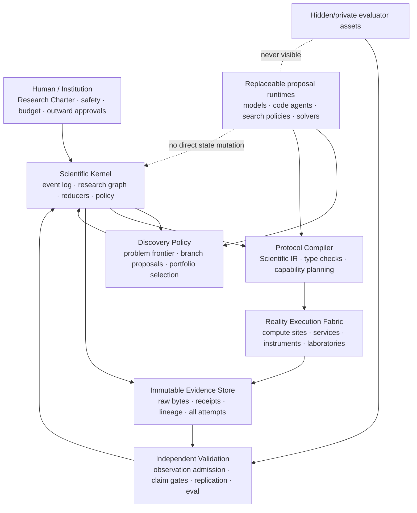

# Aletheia 端到端自主科研目标架构

日期：2026-08-22

状态：目标架构 RFC；尚未代表代码已经完成迁移，也不代表已经取得领域通用的自主发现

关系：本文取代“把某几个现成系统组合起来”作为 Aletheia 北极星的思路。
`CODEX_HARNESS_LDM_BENCHMARK_STRATEGY_2026_08_21.md` 保留为相关技术调研记录，但不再定义系统分层、
模块名称或实施顺序。

## 0. 决策摘要

Aletheia 的下一步不是接入更多 agent、模型、搜索器或 benchmark，而是完成一次控制面重构：

1. **建立唯一的科学权威。** 以不可变事件和类型化研究状态图作为唯一事实来源，结束
   legacy `Run/ExperimentDriver` 与 F8–F11 科学账本并存的双控制面。
2. **保留确定性，删除固定研究流水线。** 科学状态转换必须可验证、可重放，但整个项目不再被限制为
   `survey → ideate → train → optimize → write`。每个 action 有自己的确定生命周期；项目拓扑由证据决定。
3. **把科研意图编译成可执行协议。** 新增领域无关的 Scientific Protocol IR 和 compiler，将问题、
   epistemic contract，以及按任务需要出现的假设、可观测量、干预、控制、证明义务、统计/停止规则和 claim
   ceiling 编译成 capability/work-order DAG。
4. **用能力组合替换 `DomainPlugin`。** 领域知识表现为 ontology、measurement、simulation、analysis、
   instrument 和 validation capabilities；内核不再要求所有科学都能写成 `X/y/groups → headline metric`。
5. **让模型只拥有提议权。** 任意模型或 agent runtime 都可以提出问题、理论、方法、代码和下一步；只有
   scientific kernel、policy、compiler、validator 和 ledger 可以授权动作、接纳观察、更新信念和晋升主张。
6. **建设真正的计算与现实执行平面。** 三台 GPU 主机不是三个 SSH backend，而是三个带资源证明、租约、
   checkpoint、内容寻址制品和签名执行回执的 compute sites；仪器、外部实验室和付费服务以后使用同一个
   action/observation contract。
7. **用前瞻性发现而不是论文外观验收。** 公共 benchmark 只做组件回归；最终验收必须是时间冻结的开放
   问题、完整 attempt 账本、与主张类型匹配的新 evidence、外部专家裁决和独立确认。

一句话目标：

> 人类给出一个有边界的研究宪章；Aletheia 自主形成并选择值得研究的问题，构造和修订竞争解释，发明或
> 获取必要的方法与测量能力，调度计算和现实实验，依据被独立接纳的观察更新研究路线，并最终输出可复现、
> 不超出证据的新知识。

## 1. “端到端自主科研”到底意味着什么

### 1.1 必须闭合的循环

完整能力不是“能完成一篇论文”，而是以下循环可以在没有人工逐步指定 dataset、metric、method 和 pivot
的情况下反复运行：

```text
Research Charter
  → 识别知识缺口、矛盾、异常或新可实验机会
  → 形成并筛选研究问题
  → 选择 characterization / estimation / discrimination / qualification / formal 等 epistemic contract
  → 按需构造竞争理论、假设或因果模型
  → 推导可区分预测、可观测量、约束或证明义务
  → 设计或发明测量、模拟、分析、干预或证明方法
  → 预注册并编译可执行协议
  → 调度计算、外部服务、人工或物理仪器
  → 保存原始运行，独立接纳 observation
  → 更新信念、主张、反例和未决问题
  → continue / replicate / redesign / backtrack / fork / stop
  → 形成 claim-to-evidence bundle，并寻求与 claim type 匹配的独立确认
```

其中“自主”是宪章内的决策自治，不是无限权限。研究价值、安全边界、预算、数据使用权、可发布的最高
claim 等级和不可逆动作审批由人类或机构预先设定。

### 1.2 不是目标的东西

- 不把调优某个公开 leaderboard 叫作科学发现；
- 不把一个预先给定 dataset 上的自动分析叫作问题形成；
- 不把更多 token、更多角色或更多工具调用当作科研进步；
- 不用单个 reward、Elo、LLM judge 或论文接收结果充当科学真值；
- 不要求所有领域共享同一种数据结构、模型接口或统计终点；
- 不把同一代码、同一数据、同一机器的重跑叫作独立复现；
- 不因 gate 预先要求 pivot 就在正向证据下制造一次没有科学依据的 pivot。

### 1.3 当前诚实位置

Aletheia 已具备很强的证据约束、耐故障和能力认证原语，但它目前主要证明的是：可以可靠地自动执行并
审计一类已定义的计算实验。它尚未证明能从宽泛 mission 自主形成重要问题、改变 representation 或
measurement、获得与主张类型匹配的新 evidence，并经独立确认后形成新知识。

2026-08-22 完成的真实 endurance gate 很能说明这个边界：运行持续 `268,393` 秒，保存 `73` 个
checkpoint，最大间隔 `3,837` 秒；权威 report 记录了一次 reproduction，以及进程故障恢复、provider
故障恢复、负结果和 portfolio 计数。当前冻结 bundle 没有保留该 reproduction 的结论 payload，且其历史
数据库来源是 operator-attested，因此这些记录支持、但不能独立重建或证明长期账本和恢复机制。终态仍
正确地是 `blocked`，唯一 blocker 是 `structural_pivots:minimum_not_met:0/1`；它更不证明开放式科研适应
能力。在复现没有产生相反证据时不 pivot，反而是科学上更诚实的行为。后续 durability gate 应把“能
正确处理需要 pivot 的情形”放入独立挑战，而不是要求每次正向 campaign 都发生 pivot。

## 2. 现有架构的根因诊断

### 2.1 双控制面

当前真实产品路径大致是：

```text
用户目标
  → API 进程内 scoping
  → legacy Run + 自由 JSON plan
  → 人工连接 dataset
  → durable research.experiment_driver.v1 task
  → 5691 行 ExperimentDriver
  → 固定阶段与 DomainPlugin
  → local/docker compute
  → legacy Claim/Metric/Artifact/Report
```

直接证据：

- `aletheia/orchestrator/session.py:35-63` 要求人类确认 objective、dataset、method、baseline、metric 和
  success criteria；这是一份实验委托书，不是宽泛研究宪章。
- `aletheia/api/runs.py:33-53` 在 API 进程中启动 scoping；`aletheia/api/runs.py:103-137` 只有数据
  ready 后才排入 driver。
- `aletheia/scheduler/statemachine.py:21-31` 定义固定全局阶段；
  `aletheia/scheduler/driver.py:166-5688` 同时承担调研、假设、编码、实验、分析、campaign、验证和写作。
- 新的 Quest/Program/Campaign、F8 knowledge、F9 world model、F10 capability 和 F11 portfolio 对象比
  legacy 模型更强，但主 `ExperimentDriver` 并未把它们作为权威控制路径。

因此现在不是“缺少一个新模块”，而是产品执行和科学内核之间尚未统一。

### 2.2 内核抽象实际上是回归 benchmark

- `aletheia/domains/base.py:31-74` 用单个 `headline_metric`、min/max、SOTA 数值、feature matrix 和
  baselines 描述一个领域。
- `aletheia/domains/base.py:147-199` 强制每个插件实现
  `load_data → featurize(X,y,groups) → train_evaluate`。
- `aletheia/domains/protocol.py:1-264` 是固定 MAE/R²/RMSE、RepeatedKFold、GroupKFold、holdout 和
  baseline panel 的连续回归协议。
- RAG 插件必须让 `featurize/train_evaluate` 抛出 `NotImplementedError` 并重写执行流；这不是一个
  特例，而是基础抽象不成立的反证。
- `ExperimentDriver._optimize` 主要尝试一个 alternate baseline，再按 headline metric 选优。

这套设计适合保存为一个经过良好验证的 `supervised_regression` capability pack，但不能继续定义整个
科学系统。

### 2.3 科学对象存在，但缺少可执行连接

当前值得保留的对象包括：

- F8 的 corpus、source span、atomic claim、prior-art、novelty 与 protocol comparability；
- F9 的版本化 question、竞争 hypotheses、assumptions、predictions、belief、causal contract、
  observation admission 和 continuation disposition；
- F10 的 capability lifecycle、planner/executor/parser/validator 分权、typed raw run/measurement/
  observation 和 promotion；
- F11 的 durable queue、transactional scientific command、Quest/Program/Campaign 图、receipt-backed
  memory、portfolio、fault 与 endurance contracts。

缺少的是从这些对象到现实执行的唯一通道。现有 F9 `ExperimentProtocol` 主要是若干 SHA 的预注册
envelope，不是带步骤、端口、样本流、资源、checkpoint 和 validation 节点的可执行 IR；F9 continuation
产生 `measurement_redesign_required` 或 `hypothesis_set_fork_required` 后，也没有统一 controller 将其
转成下一批 work orders。

### 2.4 计算层资源盲且进程内

`aletheia/compute/base.py:15-59` 的 `JobSpec` 只有 domain、design 和 data；没有 GPU/VRAM、CPU/RAM、
镜像、输入制品、网络策略、数据驻留、checkpoint 或 deadline。local/docker backend 的终态依赖进程内
字典，Docker submit 同步阻塞、cancel 无效，driver 还有固定 600 秒等待。durable queue 已有 lease、
heartbeat 和幂等语义，但它目前只把整个 driver 当成一个黑盒 task，并不知道任务需要什么资源。

## 3. 不可妥协的架构不变量

1. **提议不等于事实。** 模型输出、agent 记忆、搜索分数和 reviewer 文本都只能形成 candidate。
2. **原始运行不等于科学观察。** 只有通过身份、校准、协议、完整性和独立 validator 检查的 raw output
   才能成为 `ValidatedObservation`。
3. **观察先于更新，但协议先于观察。** 任何 confirmatory prediction、endpoint、排除与停止规则必须在
   观察 bytes 可见前冻结；事后修改创建新 lineage，不能覆盖旧版本。
4. **确定转换，不固定拓扑。** 所有状态改变由可重放 reducer 和 policy 决定；研究可以回退、分叉、合并、
   重设计和停止，不需要穿过同一组全局阶段。
5. **所有尝试都计数。** infra retry、scientific replicate、failed、negative、invalid、blocked 和人工接管
   都进入账本；禁止 best-of-N 隐藏失败率。
6. **主张强度由证据链封顶。** 相关、预测、within-model causal、mechanism candidate、experimental
   causal 等结论不能仅靠文字 reviewer 互相升级。
7. **规划、执行、接纳和裁决分权。** 同一 principal/implementation 不能同时生成候选、执行测量、验证
   raw bytes 和批准最终 claim。
8. **能力也是待验证对象。** 新代码、分析法、模拟器、仪器适配器或 scorer 必须从 provisional 经校准、
   对抗测试和独立复现后才能注册。
9. **科学计划与资源调度分离。** planner 决定哪项行动有科学价值；allocator 决定在哪个资源节点执行。
10. **自治权限不随能力自动增长。** 通过 benchmark、72 小时运行或一次发现不会自动开放资金、私有数据、
    仪器、发布或不可逆动作。
11. **摘要永远不是权威存储。** 上下文压缩、world-model summary 和跨项目记忆必须能追溯到不可变对象；
    摘要丢失不应改变科学状态。
12. **IP、密钥和 hidden evaluator asset 不进入研究上下文。** 模型看到逻辑 capability/site，不看到基础
    设施凭据、private holdout 或 scorer 实现。

## 4. 目标架构：六个权威边界

这些是职责和权限边界，不是六个现成产品，也不要求每个边界由一个 LLM agent 实现。



### 4.1 Research Charter / Authority

`ResearchCharterVersion` 是人类赋予系统的长期 mandate，而不是一项具体 experiment：

- mission 与 value boundary；
- 可研究/不可研究的范围；
- safety、ethics、license、privacy 和 egress policy；
- 预算与时间边界；
- 允许的 compute、external service、human protocol 和 physical action classes；
- 自动执行、一次性审批和必须人工审批的边界；
- 可对外发布的最高 claim 与 disclosure 要求；
- charter 修改权限和 emergency stop。

它不要求用户预先给 dataset、headline metric、method 或单一 hypothesis。那些是研究系统需要发现或
设计的对象。

### 4.2 Scientific Kernel

Scientific Kernel 是唯一能够提交科学状态变化的部分。它包含：

- append-only `ResearchEvent` log；
- 从事件确定性重建的 `ResearchStateGraph`；
- command authorization、optimistic version 和 idempotency；
- preregistration、data-role、budget、approval、authorship 与 evaluator 隔离 policy；
- action-level lifecycle reducer；
- belief、claim、contradiction、objection 和 stopping 的提交规则。

这里的“唯一权威”不意味着把所有 raw bytes 再复制进第三套数据库：

- content-addressed object/evidence store 是论文、数据、协议、raw artifact 和 receipt bytes 的物理事实来源；
- event log 只权威记录这些对象是否被接纳、它们的关系、scope 和 lifecycle；
- relational tables、graph snapshot、search index 和 dashboard 都是可从 object + event 重建的 projection；
- 对象先进入 quarantine 并完成 digest 验证，再由一个 scientific command 事务提交 admission event 与
  outbox；事务失败留下可回收 orphan，不能留下已接纳但不存在的对象；
- 每个 event 带 `event_schema_version` 和 `reducer_version`；升级使用显式、测试过的 upcaster，并同时保留
  原始事件，不能就地改历史 bytes。

模型可以提出 `ResearchCommandProposal`，但不能调用数据库写 API。kernel 将 proposal 机械验证后，才
生成带 principal、parent hashes 和 policy receipt 的 committed command。现有 `/programs` 等 mutation
API 在 cutover 后也必须只提交 kernel command；无法迁移的旧 API 降为只读/legacy scope，不能绕过内核。

### 4.3 Discovery Policy

Discovery Policy 消费 research graph 的“未决 frontier”，而不是阅读一份最后聊天摘要。frontier 包括：

- 文献中尚未解决且检索覆盖可量化的矛盾；
- 可复现异常、稳定 residual 或现有理论无法解释的 observation；
- 对当前竞争假设有高区分价值的 measurement gap；
- 失败实验暴露的 protocol、measurement、method 或 representation 缺陷；
- 新 capability 使过去不可实验的问题变得可行；
- 需要 replication、boundary test 或 adversarial challenge 的已有 claim。

多个可替换 proposer 可以产生 problem、hypothesis、method 和 action candidates。系统随后在 hard
constraints 下做 Pareto/portfolio 选择，显式保留 scientific importance、novelty confidence、
discriminability、feasibility、risk、cost、option value 和 replication debt，而不是压成一个可被投机的
“science score”。

### 4.4 Protocol Compiler

compiler 把科学意图变成机器可检查、可调度、可执行、可验证的 work-order DAG。它不生成科学事实，
也不决定最终 claim。详细 IR 见第 6 节。

### 4.5 Reality Execution Fabric

execution fabric 统一计算、模拟、外部 API、人工实验步骤和物理仪器。每一种现实接触方式实现相同的
typed contract：输入身份、执行能力、资源、校准、安全、实际偏差、raw bytes、失败与 receipt。

### 4.6 Independent Validation

validation plane 与 proposal/execution 隔离，负责：

- raw artifact 完整性、schema、sample/instrument identity 和 calibration；
- 预注册一致性、统计计划、multiplicity 和 protocol deviation；
- 独立解析、重算和 artifact-to-claim 对齐；
- novelty/SOTA coverage、替代解释排除和 claim ceiling；
- private benchmark、prospective quest 和外部 replication custody。

它可以拒绝或限制 observation/claim，但不能为生成器提供 hidden scorer 梯度。

## 5. 研究状态图与事件语义

### 5.1 一等对象

| 对象 | 它回答的问题 | 关键语义 |
|---|---|---|
| `ResearchCharterVersion` | 系统为什么、在什么边界内研究？ | 人类/机构授权；child version 不能回改历史权限 |
| `Opportunity` | 为什么现在值得提出一个问题？ | 绑定矛盾、异常、缺口、能力变化或现实需求证据 |
| `ResearchProblemVersion` | 研究对象、重要性和未知量是什么？ | 可 refine/fork/retire；保留选择与淘汰 lineage |
| `ResearchQuestionVersion` | 哪个可回答问题正在被研究？ | kind、scope、answer space、价值和可证伪性 |
| `EpistemicContract` | 本 action 以什么形式减少未知？ | tagged union：hypothesis discrimination、characterization、estimation、constraint、qualification、formal proof |
| `WorldModelSnapshot` | 哪些竞争解释仍成立？ | 仅 hypothesis-discrimination contract 强制；hypotheses、assumptions、causal structure、belief |
| `ObjectiveContractVersion` | 本轮什么结果有信息价值？ | 探索目标与冻结确认终点分开；允许的修订类型 |
| `DesignSpaceVersion` | 哪些对象、干预、表示和约束可被探索？ | support、不可行区、parent delta、扩展触发证据 |
| `MethodVersion` | 当前测量/模拟/分析方法是什么？ | assumptions、semantic delta、适用域、parent lineage |
| `ObservableSpec` | 理论如何映射到可测量量？ | unit、uncertainty、instrument、calibration、identity |
| `ResearchActionProposal` | 为什么执行这个行动？ | epistemic purpose、候选 outcomes、成本/风险、alternatives；不限定为实验 |
| `ProtocolIR` | 精确要怎么做和怎么判？ | 预注册、步骤 DAG、controls、analysis、stopping、claim ceiling |
| `WorkOrder` | 哪个 executor 执行哪一步？ | capability、command hash、typed ports、resources、expected artifacts、replicate kind/count/seeds/site |
| `ExecutionIntent` | 一个 WorkOrder node 的哪次执行可进入 placement？ | exact node/command/resource/replicate binding 与逐 input-port 的 typed artifact-receipt binding |
| `ExecutionAttempt` | 现实中实际发生了什么？ | node/site、环境、raw output、deviation、usage、failure category |
| `ValidatedObservation` | 哪些 raw bytes 可进入科学状态？ | validator independence、uncertainty、positive/negative/inconclusive |
| `BeliefStateVersion` | 新观察怎样改变竞争解释？ | frozen likelihood/update receipts 与 sensitivity |
| `ClaimVersion` | 现在可以说什么？ | evidence edges、scope、strength、objections、replication level |
| `TransitionDecision` | 接下来为什么 continue/backtrack/stop？ | evidence-bound action、rejected alternatives、budget and risk |
| `EvidenceBundle` | 第三方如何重建整个结论？ | all attempts、code/data/env、claims、failures、human interventions |

### 5.2 项目不再有固定 stage FSM

不再把 proposal、编译、执行和 admission 混成一条线性总状态机。不同对象保留独立 aggregate lifecycle，
至少包括：

```text
ResearchActionProposal: proposed → authorized | rejected | superseded
ActionApplication:       pending → applied | rejected | blocked
ProtocolCompilation:    pending → compiled | blocked | superseded
WorkOrder:               ready → queued → leased → running → completed | failed | cancelled
ExecutionAttempt:        started → raw_completed | failed | reconciliation_required
                         reconciliation_required → raw_completed | failed | cancelled
ObservationAdmission:   pending → positive | negative | inconclusive | invalid | blocked
                         positive | negative | inconclusive → incorporated | superseded
                         invalid | blocked → superseded (otherwise terminal for this case)
KnowledgeAdmission:     pending → admitted | rejected | blocked | superseded
CapabilityQualification: pending → qualified | rejected | blocked | superseded
ClaimAdmission:         pending → admitted | rejected | blocked | superseded
```

一个 action 可以不需要 protocol 或 execution（例如 pause、stop、fork），也可以编译出多个 WorkOrder；
一个 WorkOrder 可以有多个 infrastructure attempts，一个 protocol 可以产生多个 scientific replicates 和
observations。无 execution action 的 authorization、科学状态事件和 `ActionAppliedReceipt` 在同一 kernel
command transaction 中提交，不留下半完成的 `authorized` 状态。`invalid`/`blocked` admission 解决后创建
带 parent 的新 case，不能把旧 verdict 改成 admitted。knowledge audit、capability qualification 和 evidence
synthesis 分别走对应 admission union，而不伪装成 observation。所有一对多关系由 immutable IDs 和 parent
hashes 表达，不靠阶段名称推断。

项目本身由事件图组成。合法的科研转换至少包括：

```text
propose · admit · activate · refine · narrow · expand · supersede
fork · merge · preregister · compile · dispatch · observe · validate
update-belief · challenge · replicate · backtrack · pause · stop · release
```

“确定性”意味着同一事件序列总能重建同一状态，并不意味着每个问题必须依次经过 survey、ideate、
optimize 和 write-up。

### 5.3 控制循环

```text
1. 从 committed events 重建当前 research graph
2. 机械计算 unresolved frontier、budgets、replication debt 和 hard constraints
3. 让一个或多个 proposal runtime 产生候选行动
4. type-check、去重、估计信息价值/成本/风险，并保存所有候选
5. policy 授权一个多样化的 action portfolio
6. compiler 生成 WorkOrder DAG；不可执行则返回结构化 blocker
7. execution fabric 运行并保存全部 raw attempts
8. 独立 validator 接纳、拒绝或标记 inconclusive
9. kernel 提交 belief/claim/objection 和 research frontier 更新
10. meta-controller 在有证据的情况下选择继续、复现、重设计、回退、分叉或停止
```

聊天上下文、agent thread 或 search memory 可以加速第 3 步，但任何一步都能从权威状态重新开始。

## 6. Scientific Protocol IR：从想法到现实行动

### 6.1 为什么必须有 compiler

自由 JSON `design` 只能表达“模型想做什么”，不能机械回答：变量是否可观测、假设能否被区分、控制是否
完整、样本身份是否守恒、统计计划是否在观察前冻结、站点是否具备能力，以及成功后最多能支持哪类 claim。

新路径必须是：

```text
ResearchActionProposal
  → ProtocolIR structural type check
  → registered identification / measurement / statistics / safety audits
  → kernel verifies audit receipts and policy
  → capability resolution
  → WorkOrder DAG
  → content-addressed CompilationReceipt（compiler evidence，本身不签名）
  → kernel re-verifies bindings/policy and signs an authorization command
  → allocator checks current inventory and atomically reserves budget/resources
```

compiler 机械检查 schema、hash、typed ports、dependency 和所需 audit receipts；它不假装能以领域无关代码
自行裁决 identifiability、power、measurement 或 safety。注册的 audit capabilities 产生相应 receipt，
kernel policy 验证 receipt，allocator 再依据短期 inventory 完成 placement、lease 和 budget reservation。
任何一层失败都返回诸如 `unidentifiable`、`observable_missing`、`calibration_expired`、
`capability_unavailable`、`underpowered`、`unsafe`、`data_role_conflict` 或 `resource_unavailable` 的 typed
blocker，而不是让 model 自由文本“修一下”。

### 6.2 最小 IR

下面是语义草图，不是最终 Pydantic 字段清单：

```text
ProtocolIR
  identity
    protocol_id, version, parent_sha256, charter_sha256
    problem/question/epistemic_contract/objective/design_space/method bindings

  scientific_contract
    kind
      hypothesis_discrimination | characterization | estimation | constraint_test
      capability_qualification | formal_derivation | evidence_synthesis
    epistemic_purpose
      characterize | discriminate | estimate_effect | falsify | calibrate
      reproduce | map_boundary | synthesize | acquire_capability
    optional world_model / target_hypotheses / predictions and outcome spaces
    entities / population / specimen genealogy
    interventions / exposures / comparator / controls
    observables / units / uncertainty / calibration requirements

  sampling_and_analysis
    exploration / confirmation / replication data roles
    randomization / blinding / blocking / allocation
    sample-size or precision rule
    primary and secondary endpoints
    estimator / likelihood / robustness analyses
    multiplicity / missingness / exclusions
    stopping and futility rules
    preregistration seal

  execution_graph
    typed steps and ports
    capability requirements
    input artifacts and data policies
    dependencies / fan-out / fan-in
    retry safety / checkpoint / reconciliation semantics
    resource envelope and locality constraints
    expected raw artifacts

  admission_and_claim
    parser and validator independence requirements
    observation validity rules
    positive / negative / inconclusive decision rules
    protocol-deviation policy
    maximum claim type and strength
    required reproduction tier
```

### 6.3 Type checker 的硬门

第一版至少机械检查：

1. hypothesis-discrimination action 的每个 hypothesis 都有同协议下可区分的 prediction；其他 action
   满足其对应 `EpistemicContract`，不被强制伪装成 null/primary/alternative；
2. empirical prediction 引用的 observable 有单位、范围、误差模型、测量 capability 和有效校准；
3. intervention、population、sample/specimen 与输出的 identity lineage 闭合；
4. controls 与 decision rule 能发现空输入、泄漏、退化、仪器漂移或模型投机；
5. data role 不冲突，confirmation/private/replication bytes 在授权前不可见；
6. analysis、exclusion、multiplicity 和 stopping 在观察前被冻结；
7. 每个 DAG port 的 schema、classification、license 和 egress policy 匹配；
8. executor、parser、validator 与 claim approver 满足 independence policy；
9. capability 的适用域、failure modes、sample floor、runtime 和 safety class audit receipts 覆盖该协议；
10. resource request、deadline、预算、checkpoint 和 artifact retention schema 完整；当前可执行性由
    allocator 在 authorization 时判断；
11. claim ceiling 与观察类型、识别条件和 replication tier 相符；
12. 所有 caller 可变参数都进入 content hash，不能在运行时静默改写。

### 6.4 WorkOrder 不是 scientific claim

compiler 可以把一个协议拆成 literature fetch、sample preparation、calibration、simulation、training、
measurement、parsing、statistical analysis 和 replication 等节点。一个节点工程成功，只说明其预期制品
已可靠产生；只有 admission 后的 observation 才能改变 belief，只有 claim gate 才能改变 claim strength。

## 7. 真正的探索、回退与目标演化

### 7.1 先诊断失败层级

一个负结果或失败不应直接触发笼统的 `reflection`。系统必须先在以下层级中定位：

| 层级 | 典型证据 | 合法下一步 |
|---|---|---|
| infrastructure | timeout、OOM、节点丢失、artifact upload 失败 | retry/resume/reallocate；不得改科学结论 |
| execution | capability 未按协议运行、样本丢失、设备偏差 | 修 executor/操作，保留同一 protocol lineage |
| measurement | calibration 失败、observable 噪声过高、proxy 无效 | redesign observable/measurement；重新预注册 |
| analysis/method | residual 结构、模型失配、鲁棒性失败 | child `MethodVersion` 或 alternate analysis |
| hypothesis/theory | 可靠负观察、替代解释更匹配 | 更新 belief、retire/refine/fork hypotheses |
| problem/representation | 长期平台、所有现有 observable 都无区分力 | revise question、expand design space/representation |

只有后两层可以称为科学 pivot；换 seed、修依赖或调 learning rate 不是 pivot。

### 7.2 目标不是一个可随意重写的 reward

需要同时维护三类对象：

- **Charter value**：相对稳定，定义为什么值得研究和哪些后果不可接受；只有授权者能修改。
- **Scientific objective contract**：本 branch 希望减少什么不确定性或估计什么量；可以生成 child version，
  但必须说明触发证据和旧结果可比性。
- **Execution/scorer objective**：某个具体搜索或优化步骤的代理目标；可以频繁替换，但永远不是科学真值。

确认性 endpoint 一旦冻结，不能因结果不好而改变。探索阶段可以演化 objective、scorer 和 design space，
但每次修订都保留 parent、semantic delta、触发证据和 look history，并产生新的 multiplicity/claim policy。

### 7.3 分支与 portfolio

planner 不应只保留当前“最佳”路径。每个 epoch 应保存：

- 全部候选和生成 provenance；
- 相互依赖、互斥和共享数据/能力关系；
- 科学价值向量与不确定性；
- 预计成本、机会成本、安全风险和 replication debt；
- 选中、拒绝、延迟的机械理由；
- diversity constraints，避免所有计算押在同一种表示或同一假设族；
- 已观察结果不可见的 human/general-agent shadow baseline。

acquisition、surrogate、tree search、debate 或 evolutionary proposal 都只是可插拔 proposal/selection
策略。它们可以改善“下一步采集哪个信息”，但无权接纳 observation 或批准 claim。

### 7.4 停止也是科学产出

合法停止原因包括：

- 已达到预注册证据阈值；
- 竞争假设在当前能力下不可区分；
- 关键 measurement/capability 不可获得；
- 新颖性或科学价值不足；
- 预算耗尽或 marginal information value 过低；
- 风险、伦理或数据许可边界触发；
- 可靠负结果使当前问题失去依据；
- 需要外部 replication 或人类价值判断，系统不能自行继续。

停止报告必须保留未决问题、失败方法和重新开放条件，不能只生成一篇“负结果论文”。

## 8. 用 capability composition 取代 DomainPlugin

### 8.1 小接口，而不是“每个领域一个世界”

新领域通过以下可组合 ports 加入：

| Port | 职责 | 示例，但不是内核假设 |
|---|---|---|
| `OntologyAdapter` | 实体、关系、单位、可干预量、约束与身份规则 | molecule、cell、optical mode、algorithm、population |
| `SourceAdapter` | 文献、数据库、传感器或外部数据的获取与版本化 | scholarly API、registry、instrument stream |
| `MeasurementCapability` | 将 specimen/system 映射为带不确定性的 raw measurement | spectroscopy、assay、human rating、runtime trace |
| `InterventionCapability` | 对系统施加可审计改变 | treatment、parameter change、structural edit |
| `SimulationCapability` | 在声明的模型假设下生成计算观察 | PDE、DFT、agent environment、digital twin |
| `AnalysisCapability` | 执行预注册 estimator、statistical test 或 causal analysis | regression 只是其中一种 |
| `ProtocolTemplate` | 提供领域惯例和安全默认值 | randomized trial、matched intervention、ablation |
| `ValidatorCapability` | 独立检查 identity、calibration、protocol 和 claim admissibility | unit/assay/model-specific validator |
| `SynthesisCapability` | 从 admitted evidence 生成图表、bundle 和 manuscript view | 不可创建新 evidence |

并非表中所有对象都是有副作用的 executable capability。`OntologyAdapter` 和一部分
`ProtocolTemplate` 是纯 content-addressed knowledge objects；source、measurement、intervention、
simulation、analysis、validator 和 synthesis 才实现有权限边界的 runtime port。F10 现有
`ExperimentCapabilityManifest` 强制 domain/question 和固定四角色，不能直接承载这些对象；A2 必须新增
`CapabilityManifestV2` 与 v1 compatibility adapter，显式记录 port kind、typed I/O、副作用、principal、
runtime、scope 和所需 audit roles。

现有 materials、molecules 和 RAG 插件先作为 compatibility packs 存在；共享回归 harness 成为一个
`GroupedRegressionAnalysisCapability`，而不是通用科学协议。

### 8.2 能力晋升

保留并扩展 F10 的 `provisional → registered → retired`：

```text
proposal
  → static policy and sandbox tests
  → calibration on known-answer fixtures
  → adversarial/degeneracy controls
  → independent implementation or site reproduction
  → scoped registration
  → online reliability monitoring
  → supersede / narrow scope / retire
```

manifest 需要补充 typed ports、hardware/runtime requirements、calibration validity、data locality、
supported uncertainty model、checkpoint behavior 和 retry safety。能力可靠性按 scope 累积，不能因在一个
材料 fixture 上通过就晋升为通用分析能力。

### 8.3 自主创建能力

需要区分两个经常混淆的对象：

- **受信任的基础能力**：measurement、parser、validator、scorer、sandbox 和 instrument adapter；触及
  confirmation data 前必须完成 scoped qualification，author 不得担任 promotion approver。
- **被研究的新方法**：`MethodVersion` 本身就是实验处理之一。它可以在预注册、冻结代码、可信执行与独立
  measurement/validator 边界下进入 confirmation；但它不能因在 confirmation 上表现良好就自动晋升为
  通用 evaluator 或 trusted dependency。

系统可以自主提出并实现两者。provisional 基础能力先在 exploration/known-answer fixtures 上经过隔离、
calibration、negative controls 和独立验证；candidate method 则按照其 scientific protocol 接受公平确认。

## 9. 计算与现实执行 fabric

### 9.1 逻辑站点候选与盘点证据

用户提供的三个 endpoint 在 2026-08-22 均通过只读登录验证，并暂时映射为以下逻辑站点：

| 逻辑站点 | 盘点到的 accelerator class | 架构用途 |
|---|---|---|
| `gpu-v100-a` | Tesla V100-SXM2 32GB | 高显存、checkpointable compute |
| `gpu-v100-b` | Tesla V100-SXM2 32GB | 并行 campaign 与预注册 replicate |
| `gpu-2060-a` | RTX 2060 SUPER 8GB | 小型 probe、兼容性与低成本任务 |

具体 Tailscale endpoint、登录 principal、GPU UUID、软件环境、进程占用和动态容量只进入访问受控的
deployment inventory，不进入版本化 RFC 或模型 prompt。本次 ad-hoc 盘点没有形成签名/持久 attestation，
其动态结果不能作为上线或调度依据。正式部署必须重新采集带 UTC 时间、采集 principal、命令/agent
版本、完整输出 digest 和有效期的 `NodeInventoryAttestation`。盘点没有安装软件、终止进程或修改主机。

### 9.2 不实现 `SSHBackend`

SSH 只用于 node onboarding、诊断和紧急运维。逐任务执行应是 pull-based node agent：

```text
Scientific Kernel / Compiler
  → immutable ExecutionIntent
  → admission + budget reservation
  → durable resource-aware queue
  → Node Agent pulls through Tailscale/mTLS
  → atomically leases a concrete GPU UUID
  → stages content-addressed inputs
  → runs digest-pinned environment
  → checkpoints and uploads raw artifacts
  → signs ExecutionReceipt
  → authorized verifier rehashes artifacts and binds final object version
  → RawExperimentRun
  → independent parser / validator
```

GPU node 不持有通用数据库凭据；IP 和登录信息只存在 trusted deployment inventory。planner 只能看逻辑
site capability 和当前可用容量。

生产 control plane（PostgreSQL、durable queue/allocator、object store 和 receipt verifier）必须运行在
always-on、受备份和监控的服务上，不能依赖会睡眠的交互式 Mac；Mac 只作开发客户端/可选 CPU node。
control plane 失联时，node 不接新任务；当前已授权任务只按其 frozen disconnect policy 继续或安全停止，
raw artifacts 与签名 receipts 写入有 quota 的本地 spool。恢复后先 reconciliation，不能离线自行提交
scientific success。

### 9.3 核心 execution contracts

`WorkerNodeManifest`

- logical node/site/principal、OS/arch、agent version；
- sandbox/runtime、安全策略、允许的数据分类和 egress；
- 稳定 node/principal ID，加可轮换的短期证书/密钥版本和有效期。

`NodeInventoryAttestation`

- GPU model、UUID、VRAM、compute capability、driver/CUDA；
- CPU、RAM、scratch、health、外部占用和观测时间；
- inventory hash 与短有效期。

`ExecutionResourceRequest`

- CPU/RAM/scratch/wall time；
- OCI platform、CPU architecture、container runtime/host-driver compatibility；
- GPU 数量、允许型号、最低 compute capability、所需 GPU features、driver/CUDA constraint；
- 当前 allocatable VRAM 必须扣除 safety reserve 与受管/外部占用，不能按标称显存匹配；
- exclusive/preemptible、checkpoint interval、data locality、network policy；
- max attempts、deadline 和 artifact quota。

`ResourceLease`

- task/execution/attempt、具体 node/GPU UUID；
- budget reservation、lease token hash、heartbeat/expiry；
- adoption/fencing policy。第一版一块物理 GPU 只允许一个 exclusive Aletheia job。

Aletheia lease 只能排斥 Aletheia 自己，不能阻止人工任务或外部 `pw.x`。每个 GPU site 必须使用 dedicated
execution window 或接入宿主级统一 scheduler；launch 前 agent 重新检查所有非 Aletheia GPU processes、
reserved memory 和 scratch。存在未纳管占用时等待或 fail closed，绝不以内部 lease 覆盖外部作业。

`ExecutionReceipt`

- exact intent、node inventory、image/environment、command/env hashes；
- container/process identity、start/end、exit/failure category；
- CPU/RAM/GPU/time telemetry，以及可空的 energy estimate；每项都带 source、采样间隔、缺失率和精度；
- checkpoint lineage、protocol deviations、stdout/stderr 和 artifact manifest；
- node signature 与 central verification receipt。

GPU resource lease 在 runtime 启动前取得，在对应进程确认终止后释放；staging、artifact upload、central/
site-local verification 和 retry backoff 不计入 device lease。预算按“已分配 GPU 数 × device-lease 时长”
结算，不因低 utilization 打折；利用率和能耗仅作优化与审计 telemetry，不能替代资源账本。

authored container 不获得 Docker socket、node signing key、数据库/root 凭据或任何对象存储 URL/token。
node agent 独占 execution-scoped transfer credential，下载并校验输入后以只读 mount 提供；工作负载只能写
本地受 quota 的 output mount，默认 `network=none`。确需网络的受信任 adapter 使用独立 allowlist/egress
policy 和隔离 principal，不能把 transfer 或 signing credential 交给 authored code。

### 9.4 接管而不是重复执行

execution 使用稳定 `execution_id`、node binding 和递增 fencing epoch。同一节点上的新 agent 可以在核对
runtime identity 和 fence 后 inspect/adopt 既有容器或终态 receipt。不同节点不能“接管”原节点容器；
原节点结果未知时必须进入 `reconciliation_required`，只有确认旧执行终止，或通过 fencing 撤销旧 epoch
并取得可信 acknowledgment 后，才可在另一节点新建 attempt。旧 agent 恢复时必须拒绝过期 fence 并停止/
隔离对应 runtime，防止 split brain。不能因队列 lease 过期直接启动第二份实验。

需要明确区分：

- infrastructure attempt：相同科学协议的恢复/重试；
- scientific replicate：协议预先要求的新随机化、样本、实现或站点；
- external action：支付、物理操作或只允许一次的 holdout open，使用 intent/token/provider receipt/
  reconciliation 语义。

OOM、invalid output 和科学负结果不是同一种 retry。无效 scientific output 不应被普通异常处理器无限重跑。

### 9.5 Artifact 成功条件

任务只有在以下步骤全部完成后才算 engineering-succeeded：

1. node collector 拒绝 symlink、hardlink、device、路径逃逸、超 quota 和未声明输出，再将 raw artifact 上传
   到隔离 quarantine；manifest 声明 SHA-256、bytes、media/schema、parents 和 producer attempt；
2. 冻结 quarantine object version/generation。允许数据出站时由中心 verifier 流式重算 SHA-256/bytes；
   数据驻留策略禁止出站时，由授权且独立于 workload 的 site-local verifier 重算并签发 custody receipt，
   中心只接收 digest、opaque object reference 和验证链；HEAD/multipart ETag 都不能替代内容重验；
3. 使用条件写把该冻结版本提升到获准的 content-addressed namespace，再验证最终 CAS object 的 digest、
   bytes 和 version/generation；
4. 对最终 CAS identity 生成 immutable `ArtifactVerifiedReceipt`；receipt 绑定 verifier、object store/site、
   object version/generation、digest、producer attempt 和 custody chain；
5. execution receipt 与 artifact manifest 相符后，数据库事务提交 scientific outbox 与 queue completion；
6. 数据库失败不会撤回对象上传，而是留下不可见、可审计并可回收的 orphan；reconciler 可按 receipt 重放；
7. 任意 partial upload、错 hash、缺对象、版本漂移或伪造 manifest 都 fail closed。

这仍然不等于 scientific success。候选程序写出的 `metrics.json` 只能作为 raw artifact，必须由独立
parser/validator 从原始 bytes 重算后才可成为 observation。

### 9.6 三节点上线顺序

1. 在本机实现 `LocalNodeAgent`，先复用现有 hardened sandbox，证明 receipt 和同节点接管语义；
2. 重新盘点后选择一个无外部占用、磁盘配额充足的节点做 canary；2060 是候选而不是永久假设；
3. 为 V100 取得 dedicated window/宿主 scheduler 集成与部署授权后，再分别 onboarding；
4. 验证定向调度、两 V100 并发、资源不匹配 fail closed 和 GPU-hour 实测结算；
5. 再开放 checkpointable 长任务和跨节点 exact reexecution/hardware-portability checks。

上线需要在远程主机安装受管 Python/Conda 环境、sandbox runtime 和 node service；本 RFC 没有执行这些
变更，实施时需单独审批并保留 deployment manifest。

## 10. Observation、claim 与现实桥

### 10.1 从现实到信念的单向边界

```text
Pre-observation seal
  → frozen predictions / likelihood or estimator / proof obligations / analysis / decision rules
  → ExecutionAttempt
  → RawArtifact / RawMeasurement
  → identity + calibration + protocol audit
  → independent parse/recompute
  → ValidatedObservation
  → apply the precommitted likelihood / estimator
  → BeliefStateVersion
  → ClaimVersion + unresolved objections
```

每一层只能引用前一层的 hash，不允许将 report prose 反向写成 observation。

### 10.2 Observation 必须保留五种结果

| 结果 | 含义 | 是否更新科学状态 |
|---|---|---|
| `validated_positive` | 预注册正向条件成立 | 是，但受 claim ceiling 限制 |
| `validated_negative` | 满足预注册的反证、等效性或有足够灵敏度的 null-support 条件 | 是；负结果是一等证据 |
| `validated_inconclusive` | 测量有效但精度/信息量不足 | 是；更新 uncertainty 和下一步需求 |
| `invalid` | 身份、校准、协议、完整性或分析失败 | 否；只更新 failure/capability reliability |
| `blocked` | 缺资源、权限、数据或独立 validator | 否；保留 blocker 与重新开放条件 |

“没有显著”“没有达到 SOTA”或“未触发正向阈值”通常是 inconclusive，不自动成为 negative；只有预注册
的反证/等效性/null-support 规则且测量灵敏度充分时才是 validated negative。“代码崩溃”也不是 negative
observation。

### 10.3 现实实验合同

物理仪器、human-in-the-lab 或外部站点需要在 compute contract 上增加：

- specimen/sample genealogy 与 chain of custody；
- instrument、firmware、site、operator/robot identity；
- calibration record、environment state 和允许的 operating envelope；
- safety interlock、approval、emergency stop 与责任 principal；
- protocol translation、人工修改、实际执行偏差和缺失步骤；
- raw sensor/data return、uncertainty、failed/aborted attempt；
- external acknowledgment、idempotency 和 reconciliation。

人工执行不降低证据价值，但必须计入 autonomy accounting。任何人类替系统重新选 candidate、改变 protocol、
修正 measurement 或决定停止，都应记录为结构化 intervention，不能隐藏在“实验完成”背后。

### 10.4 Claim 与 publication 是视图

`ClaimVersion` 至少绑定：

- atomic statement、scope、claim type 和 strength；
- 支持、反对、矛盾和缺失证据 edges；
- protocol/analysis comparability；
- author、validator、reviewer independence；
- 尝试总数、selection history、multiplicity；
- replication tier、human intervention 和 limitations；
- 可机器检查的 claim ceiling receipt。

论文、报告、图表和 dashboard 都从 claim/evidence graph 渲染。写作器不能直接添加数字、citation、method
或结论；如果新 prose 暴露了证据缺口，它只能创建 objection 或 new-action proposal。

## 11. 三种记忆必须隔离

### 11.1 项目内权威科学记忆

包含原始 evidence、问题/假设版本、负结果、contradiction、未解决 objection、预算和 data-role。它不可
被压缩覆盖，也不可跨 project 随意迁移。confirmation/private evaluator 信息遵循严格作用域。

### 11.2 可复用的程序性知识

包括经过审计的：

- capability calibration 与 reliability statistics；
- 典型 failure diagnosis 和修复策略；
- protocol template、cost model、checkpoint 和 instrumentation 经验；
- method applicability boundary 和已知 negative-transfer 条件。

跨 Quest 复用必须生成 `TransferReceipt`，声明来源、目标 scope、支持证据、适用边界、潜在泄漏和独立
review。不能把“过去某次成功的 prompt”直接晋升成科学规律。

### 11.3 外部知识边界

文献与数据库记录保留版本、检索时间、访问权、peer-review/preprint/retraction 状态、source span、相互
矛盾和 coverage。model pretraining memory 只能提供 query candidate；不可凭记忆创建 citation 或 novelty
结论。

agent thread、上下文 compaction、临时 notebook 和 search memory 都属于可丢弃 cache。它们应该通过
`StateCapsule` 获得 task-scoped、non-droppable 的权威事实，但永远不能成为 ledger 的替代品。

## 12. 模型、agent runtime 与搜索策略的位置

核心代码不以任何模型、agent harness、搜索论文或 agent 角色命名。可替换 runtime 只实现以下 ports：

- `ProblemProposer`
- `HypothesisProposer`
- `ProtocolProposer`
- `MethodAuthor`
- `AnalysisProposer`
- `TransitionProposer`
- `SynthesisProposer`

一个 runtime 可以实现多个 port，也可以由多个模型并行实现同一个 port。角色数量取决于任务是否可并行，
而不是固定“六 agent”拓扑。每个调用只接收 port-scoped、最小权限的 `StateCapsuleProjection` 与 typed
tool specs，并记录精确披露对象的 receipt；proposal runtime 永远收不到 evaluator/private/confirmation
资产。所有模型 port 输出严格 proposal schema，并记录模型、prompt、tool、token、成本和上下文覆盖
receipt。`SynthesisProposer` 只能对 admitted claim graph 提议表述，随后由独立 claim verifier 验证；最终
renderer 是无模型、只读的确定性视图。

从现有工作中可借鉴但不写入内核名称的思想是：

- 长任务的可恢复 thread、tool event 和 context compaction；
- 共享但可追溯的 structured world state；
- 并行 proposal、branch preservation 和 experiment manager；
- empirical surrogate 与 uncertainty-aware acquisition；
- objective/design-space 的版本化修订；
- 非线性返回 measurement、method、hypothesis 或 question 层；
- claim 在生成时即绑定 evidence，而不是写完论文后补 citation。

是否采用某个实现，必须通过同模型、同工具、同预算的 shadow ablation 后晋升。runtime upgrade 只改变
proposal quality，不能改变 validation policy 或历史 evidence。

## 13. 评测：从组件能力到前瞻性发现

### 13.1 Aletheia 自己的能力等级

避免使用没有命名空间的“L1–L4”。本文定义 `Aletheia Research Autonomy Level (ARL)`：
ARL 是累积等级：晋升必须同时满足所有较低等级的冻结证据，不允许用一次高层演示跳过完整性或可靠性。

| 等级 | 必须证明的能力 | 不能据此声称什么 |
|---|---|---|
| `ARL-0 Integrity` | ledger、sandbox、hidden boundary、all-attempt、replay、claim ceiling 不变量 | 不能声称会做科学 |
| `ARL-1 Protocol Executor` | 在给定问题和协议下可靠执行，并按预定义 validator 验收、复现和报告 | 不能声称自主设计研究或已证明科学有效性 |
| `ARL-2 Question-bound Scientist` | 给定研究问题，自主构造竞争解释、设计区分实验、处理负结果并回退 | 不能声称自主选重要问题 |
| `ARL-3 Mission-bound Researcher` | 仅给 mission/charter，自主形成问题、演化方法/measurement/design space，并获取该 modality 所需的新 evidence | 不能声称领域通用或已独立发现 |
| `ARL-4 Independently Confirmed Autonomous Discovery` | 新主张通过时间冻结的 prior-art 审核、外部专家裁决和与 claim type 匹配的独立确认 | 仍不自动获得无限现实权限 |

当前 Aletheia 在若干受限计算任务上部分满足 `ARL-1`，但还没有一份冻结的系统级 ARL 资格 receipt；
它也拥有若干 `ARL-2` 所需但未由主控制面贯通的 F8–F11 原语。没有 `ARL-3` 或 `ARL-4` 证据。

ARL-4 的独立确认按主张类型定义：

- empirical/physical claim：新前瞻观察，并由组织和执行 principal 独立的外部站点按预注册要求改变
  operator/instrument/site 等关键维度复现；
- computational claim：独立实现、未见数据/实例和冻结 evaluator，不能只换一张自有 GPU；
- formal/theoretical claim：machine-checkable proof，或独立推导/审查与明确的经验预测；
- mixed claim：同时满足其经验、计算和理论组成部分的最高要求。

### 13.2 四层评测组合

| 评测层 | 目的 | 主要形式 | 决不能替代 |
|---|---|---|---|
| component | 防止文献、代码、统计、工具和安全能力回归 | public/frozen benchmarks、known-answer fixtures | end-to-end discovery |
| campaign | 测试隐藏规律、因果区分、branch/backtrack、resource awareness | private simulated worlds 与 bounded research tasks | 前瞻性新知识 |
| publication-frozen private shadow | 原作者已有私有答案、但对 agent 隐藏的真实开放问题 | 多日任务、完整 repo/log/cost、all attempts | 对人类未知的新知识或外部复现 |
| claim-specific independent confirmation | 按 claim type 验证新结论是否跨执行者、实现、数据、仪器或推导成立 | 盲法外部执行、独立实现、machine check、预注册复现 | 领域通用性 |

公共 benchmark 继续用于 regression testing；ScienceAgentBench、CORE、AstaBench 和
[DiscoveryWorld](https://papers.nips.cc/paper_files/paper/2024/hash/13836f251823945316ae067350a5c366-Abstract-Datasets_and_Benchmarks_Track.html)
等可以覆盖不同组件或 bounded campaign，其中 DiscoveryWorld 只是低保真模拟 campaign gate。它们不是
最终总分，不能因为 solved-rate 上升就晋升自主科学 claim。

### 13.3 Private shadow 与 Prospective Discovery Suite

首先保留 publication-frozen private shadow：独立委托者在系统冻结后交给 agent 一个未公开研究问题，
原作者持有答案并审查完整轨迹。它主要评估 research judgment、backtracking、resource awareness 和
instruction drift，不声称发现了对人类未知的新知识。

真正的 Prospective Discovery Suite 还必须满足：

1. 每项 mission 先通过预冻结的 `MissionAdmission`：独立领域专家确认 temporal cutoff 下问题尚未解决，
   不是例行复现、常规调参或小 benchmark 改进，具有实质科学价值、足够开放的解法空间和可执行的裁决
   标准；分歧按预注册 adjudication policy 处理，不能由系统团队挑选有利意见；
2. 由独立 commissioning/evaluation principals 设计并一次性保管；在模型、系统、策略和预算冻结后才
   揭示 mission，并记录 temporal cutoff、训练/开发污染审计与每项 asset disclosure；
3. mission 可以在科学上自然时提供 dataset、target observable 或仪器，但不得提供答案、解法配方、
   hidden scorer、replication outcome 或足以反推它们的选择信息；
4. research principal、evaluator、asset custodian 和 external replicator 权限隔离；研究端只能看到
   task-scoped projection；
5. 系统自主形成并选择 problem/question branches、epistemic contracts 和实验路线；
6. **跨 suite 而不是每个 mission** 预先覆盖 capability 新建/修复、null/confounded/inconclusive、
   measurement redesign、resource scarcity 和正确 stop/backtrack；同时包含“不该修 capability、不该
   pivot、不该增加计算”的匹配任务，评价克制；
7. 系统在冻结资源约束下自行选择是否使用一台或多台节点，执行 controls/ablations/replicates，并保存
   全部 attempts；不得为了 gate 强制使用三台特定机器；
8. 每个拟晋升或发布为 ARL-4 discovery、且越过预冻结 promotion rule 的 claim 都进入第 13.1 节按 claim
   type 定义的独立确认；探索候选可以被驳回、保留 tentative 或停止。进入确认后的失败、超时或无法复现
   按预冻结 missingness rule 计入，不能事后只送最有希望的 claim。物理主张必须有组织/执行 principal
   独立的外部实验，换数据或换自有节点不能替代；
9. 独立专家审查完整 trajectory、负结果、人工介入和 selection history，不只看 final paper；
10. 固定脚本、通用 agent、去掉关键 evidence gate 的消融和完整 Aletheia 采用 paired/randomized allocation；
   各 arm 冻结相同基础模型版本、mission disclosure、数据、工具、网络、计算资源、现实权限、人工协助和
   stopping window，只允许被消融的 scaffold/evidence-policy 部分变化；
11. seeds/attempt families、aggregation、stopping、missing-run 和 promotion rule 在 suite 开始前冻结，禁止
    best-of-N；
12. external replicator 在提交不可撤回 execution/admission receipt 前，只接收冻结 protocol、样本/实例和
    必要 calibration 信息，不可看到 candidate outcome、agent trajectory、selection rationale 或专家 verdict。

一次 mission 可以验收一个具体 discovery claim；它不能授予系统级 ARL-4。系统资格需要多个预注册
prospective missions 上的 aggregate reliability、false-discovery rate、独立确认率、novelty、importance 和
autonomy/human-intervention 达到冻结阈值；至少一个成功 claim 必须带来实质机制、预测、方法或测量增量，
不能只提高 headline metric。

结果报告向量，而不是一个总分：

- claim correctness 与 false-discovery rate；
- novelty coverage 与科学重要性；
- causal/mechanistic explanatory gain；
- predictive calibration；
- independent replication；
- correct stop/backtrack rate；
- total compute、现实实验成本与 wall time；
- human intervention fraction；
- failure disclosure completeness；
- safety、policy 和 hidden-data violations。

三台自有 GPU 能提供执行并行度、硬件多样性和故障隔离，但在同一团队、同一实现、同一协议下跨两台
V100 重跑只能称为 exact reexecution/hardware portability，不能称作 implementation reproduction，
更不能称作独立科学复现。

### 13.4 endurance gate 的修订

既有 real-time v1 manifest 和 terminal blocked report 是不可变历史，不能修改或重新解释。另行生成一份
引用其原始 report SHA-256 的 derived operational interpretation；未来运行发布 versioned gate v2，再将
durability 与 scientific adaptation 拆开：

- `Operational Endurance Gate`：只测时间、恢复、幂等、artifact、budget 和零状态损失；不要求 pivot。
- `Adaptive Research Challenge`：隐藏世界预先包含至少一个必须 redesign/backtrack 的 branch，评价系统
  是否在有证据时 pivot、在无证据时不 pivot。
- `Prospective Discovery Gate`：评价真实开放问题与独立 replication。

这能避免为了 gate 过关而制造科学上错误的动作。

## 14. 相关工作：按能力原语取证，不按系统拼装

在本文检索到的一手公开证据中，截至 2026-08-22 未见任何系统证明“自主形成重要开放问题 → 自主获得
与 claim type 匹配的新证据 → 完成该 claim type 所需的独立确认”这一领域通用闭环。下面只标注来源/
发表状态：**[PR] peer-reviewed**、**[PP] preprint**、**[OP] official project report**；它们不是证据强度，
科学证据还必须另看 scope、执行独立性、前瞻性和复现状态。

| 能力原语 | 一手证据（按证据类型） | 对 Aletheia 的有限启示与边界 |
|---|---|---|
| 权威状态、evidence lineage 与 provenance | [Kosmos, PP](https://arxiv.org/abs/2511.02824)；[Qiushi, PP](https://arxiv.org/abs/2604.27092)；[ScientistOne/Chain-of-Evidence, PP](https://arxiv.org/abs/2605.26340) | 使用 typed shared state、数字/物理统一 artifact spine，并在 claim 创建时绑定 evidence。Kosmos 从科学家指定目标和人工整理/预处理数据开始；Qiushi 是单一光学平台；ScientistOne 在作者 benchmark 中报告 artifact 可验证，均未证明领域通用问题形成。 |
| 非线性控制、分支保存与失败回退 | [Qiushi, PP](https://arxiv.org/abs/2604.27092)；[AI Scientist-v2, PP](https://arxiv.org/abs/2504.08066)；[CRUX, PP](https://arxiv.org/abs/2607.27191) | action 应能返回 observable/method/hypothesis/question 层，失败分支与 all-attempt lineage 不应被覆盖。tree search 或长轨迹本身不保证研究判断；CRUX 暴露了 ineffective backtracking 和 instruction drift。 |
| proposal 多样性、经验选择与 objective 修订 | [AI Co-Scientist, PR](https://doi.org/10.1038/s41586-026-10644-y)；[LDM, PP](https://arxiv.org/abs/2608.15669)；[SAGA, PP](https://arxiv.org/abs/2512.21782) | 多样化 proposal、empirical surrogate/acquisition 和版本化 objective/scorer 可以作为可插拔策略；内部 Elo 或 acquisition 不是科学真值。SAGA 明确保留预定义 design modality，只支持 objective/scorer 演化；`DesignSpaceVersion` 是 Aletheia 对 LDM 式支持集扩展与自身需求的进一步抽象，不是 SAGA 的结论。 |
| 现实执行与人工 intervention accounting | [Qiushi, PP](https://arxiv.org/abs/2604.27092)；[Robin, PR](https://doi.org/10.1038/s41586-026-10652-y) | 现实平台需要统一 protocol/artifact contract；human translation、candidate selection、protocol 修订和停止判断必须计账。单一平台同团队验证，或有人把实验做完，都不能直接计作系统自治与外部复现。 |
| 独立评测与开放问题审查 | [ScienceAgentBench, PR](https://proceedings.iclr.cc/paper_files/paper/2025/hash/f12b4df26344f3be803c06b555252efe-Abstract-Conference.html)；[CORE, OP](https://crab.cs.princeton.edu/core-website/)；[AstaBench, PR](https://proceedings.iclr.cc/paper_files/paper/2026/hash/b2ce9568dbb559aefc8c98ca5b5314ce-Abstract-Conference.html)；[CRUX, PP](https://arxiv.org/abs/2607.27191) | frozen benchmark 适合组件/重放回归；publication-frozen shadow 适合研究判断。它们必须和真正 prospective、claim-type-specific independent confirmation 并存，不能合成一个论文质量总分。 |

CRUX 的两个案例中，agents 在六天内完成了工程，却没有实质推进研究问题，并暴露 publishability
judgment、research-design 修复、dead-end backtracking、resource awareness 和 instruction adherence
五类失败。这些应成为架构级 telemetry 和验收维度，而不是靠一段更长 system prompt 解决。

## 15. 现有代码：保留、重构、替换

### 15.1 保留并升级为内核依赖

| 现有区域 | 保留原因 | 必要升级 |
|---|---|---|
| `aletheia/jobs/queue.py`, `worker.py`, `outbox.py` | lease、heartbeat、幂等、事务 command 是正确基础 | resource routing、typed failure、execution adoption |
| `aletheia/programs/` | Quest/Program/Campaign、预算、data role、memory、portfolio、endurance | 成为 kernel-owned aggregates/projections；现有 mutation 全部经 kernel command；portfolio 从 shadow 晋升需新 gate |
| `aletheia/knowledge/` | source-span claim graph、coverage、prior art、novelty、comparability | 接入 problem frontier 与 claim gate，而非只做旁路检查 |
| `aletheia/epistemics/` | competing world model、prediction、causal contract、belief update | 发布 graph-scoped schema v2；v1 保持只读兼容，不制造 synthetic legacy Run |
| `aletheia/capabilities/` | 角色分离、生命周期、typed observation、promotion | CapabilityManifestV2：纯知识/副作用 ports、resource/site、calibration 和 cross-project reliability |
| `aletheia/evals/` | hidden custody、independent runner、all-attempt、signed receipt | 与 research namespace/credentials 严格隔离；可复用 node receipt 形状 |
| `aletheia/reproducibility/` | content hash 和 frozen manifest | 从 per-run 扩展为每个 execution attempt 和 full bundle |
| sandbox、IAM、one-time external actions | 安全和不可逆动作边界 | 扩展到 GPU node 和现实实验 adapter |

### 15.2 拆分和重新接线

| 当前对象 | 目标拆分 |
|---|---|
| `ExperimentDriver` | 逐项抽取 proposal、evaluation、execution、observation 和 rendering 行为；完整 driver 只保留为隔离 legacy workflow，绝不嵌入新 kernel |
| `DomainPlugin` | ontology/source/measurement/intervention/simulation/analysis/template/validator capability ports |
| `Run.plan` 自由 JSON | charter/problem/objective/design-space/method/protocol 的不可变 versioned objects |
| `ComputeBackend` | execution contracts、resource-aware queue、site registry、allocator、node agent、artifact/receipt verifier |
| `portfolio mode=shadow` | 先保持 shadow；通过 causal gate 后才允许提交实际 action portfolio |
| write-up pipeline | evidence graph 的只读 renderer + claim verifier |

### 15.3 明确替换

- 用 deterministic typed transition authority 替换固定全局 `PHASE1_STAGES`；
- 用 `ProtocolIR` 替换 `design: dict` 作为生产执行合同；
- 用 resource fabric 替换 local/docker factory 作为长期 compute API；
- 用版本化 method/measurement/design-space evolution 替换“alternate baseline 即 optimize”；
- 将 materials/phonon、molecules、RAG 降为 reference capability packs 与 regression fixtures；
- 停止让 legacy mutable Claim/Beta credence 与新 immutable epistemic objects 双写；
- 停止把完整 driver 当作一个 durable black-box task。

现有 F9 `ResearchQuestion/Hypothesis/Belief` 强制 legacy `run_id`；新内核不得为了复用它们而创建假的
Run。A2 发布 graph-scoped v2 identity（`scope_node_id` + stable lineage + content version），并为已存在
v1 objects 提供只读 binding/migration receipt。Claim 也采用同一 scope/version 规则，避免同时存在 legacy
mutable claim、新 claim version 和第三套 identity。

### 15.4 建议的新包边界

```text
aletheia/
  research_kernel/
    schemas.py          # charter/problem/action/event/transition contracts
    commands.py         # proposal → authorized command
    reducer.py          # event log → ResearchStateGraph
    frontier.py         # unresolved scientific frontier
    policy.py           # hard gates, authority, data/budget/independence
    controller.py       # thin event-driven coordinator

  protocols/
    schemas.py          # Objective/DesignSpace/Method/Observable/ProtocolIR
    typecheck.py        # structural checks and required audit-receipt contracts
    compiler.py         # ProtocolIR → CapabilityPlan → WorkOrder DAG
    claim_contracts.py

  execution/
    schemas.py          # node/resource/intent/attempt/receipt/artifact contracts
    registry.py         # trusted sites and short-lived inventory
    allocator.py        # resource placement, lease, budget reservation
    artifacts.py        # content-addressed transfer and verification
    node_agent.py       # local/remote pull worker protocol
    admission.py        # receipt → RawExperimentRun

  planning/
    proposals.py        # replaceable model/search ports
    portfolio.py        # multiobjective selection and diversity
    transition.py       # evidence-bound next-action proposals

  observations/
    admission.py        # raw → validated observation
    claims.py           # observation → claim ceiling / objections
    transfer.py         # audited cross-Quest procedural memory
```

现有 `knowledge/epistemics/capabilities/programs/jobs/evals` 不应搬家重写；上述新包负责连接和补齐缺失对象，
随后逐步把 legacy driver 行为迁入这些权威接口。

## 16. 实施路线：先统一权威，再扩大自治

下面的切片按依赖排列。时间是单人全职工程的粗略量级，不是科学结果承诺；可以并行开发 schema、
execution 和 evaluation，但不能跳过前置 authority contract。

### Slice A0：冻结 legacy 行为和迁移规则（3–5 天）

目标：避免一边迁移一边继续向 `ExperimentDriver` 堆功能。

工作：

- 为现有 materials/molecules/RAG 路径记录 golden event/artifact fixtures；
- 标记 `ExperimentDriver`、`DomainPlugin`、`ComputeBackend` 为 compatibility APIs；
- 新增 ADR：新科学功能只能进入 research kernel/protocol/execution ports；
- 将所需 legacy records 冻结为 content-addressed snapshot，并生成绑定 source version、payload digest、scope
  和导入时间的 `LegacyImportReceipt`；禁止把 mutable legacy table 暴露成新 graph 的 live view；
- 禁止新代码继续新增 mutable claim/credence 双写；
- 生成一份引用既有 terminal report SHA-256 的派生 operational interpretation；既有 manifest/report
  永不修改。只为未来运行发布 versioned endurance gate v2。

退出条件：旧测试全部不回归；可以机械列出每个 legacy write 的未来 owner；没有尚未归属的科学状态；
dependency-boundary test 禁止 kernel/controller import `ExperimentDriver` 或 legacy mutable stores，只有后续
批准的 compatibility leaf 可以输出 raw artifact 供 admission。

### Slice A1：Scientific Kernel v1（2–3 周）

新增：

- `research_kernel/schemas.py`：`ResearchCharterVersion`、`Opportunity`、
  `ResearchProblemVersion`、`ResearchActionProposal`、`ResearchEvent`、`TransitionDecision`；
- `research_kernel/reducer.py`：纯函数 event reducer 和 graph invariants；
- `research_kernel/commands.py`：proposal/admission/transition command；
- persistence 与 Alembic migration：append-only event tables、CAS object metadata/index、expected version、
  idempotency；object payload 仍只存在 content-addressed store，metadata table 不是第二份 payload 权威；
- `ResearchStateGraphSnapshot` 与 replay/audit CLI。

复用：`ScientificTransitionStore` 的 hashing/expected-version/transaction 代码、Quest/Program/Campaign identity、
budget/data-role allocations；现有 store/API mutation 不作为并行权威。

必须测试：

- 同一 event log 跨进程重建 byte-identical snapshot；
- stale parent、重放变体、越权 principal、跨 Quest 引用和 cycle fail closed；
- negative/inconclusive/objection 不可被 compaction 删除；
- model proposal 无法直接提交 state；
- branch/fork/backtrack/stop 不依赖固定 stage 顺序。

退出条件：一个新 Quest 可以由 charter 启动，接纳并持久重建**人工或 fixture 提交**的 problem/question
branches，且不调用 legacy driver；自主问题形成留到 A6，此时仍不执行实验。

### Slice A2：Scientific Protocol IR 与 compiler v1（3–5 周）

新增：

- `protocols/schemas.py`：`ObjectiveContractVersion`、`DesignSpaceVersion`、`MethodVersion`、
  `ObservableSpec`、`EpistemicContract` union、`ProtocolIR`、`WorkOrderDAG`；
- `protocols/typecheck.py`：第 6.3 节的 hard checks；
- `protocols/compiler.py`：capability resolution、dependency graph、claim ceiling 与 compilation receipt；
- graph-scoped F9 schema v2 与 v1 read-only binding；
- `CapabilityManifestV2` 与 F10 v1 compatibility adapter；
- 最小 `ExecutionResourceRequest`、`ExecutionIntent`、`ArtifactStorePort`、`ExecutionReceiptPort`
  纯 contracts；compiler 只对冻结 capability/resource catalog 做结构可行性检查，动态 placement 留给 A3
  的单节点 allocator 和 A4 的 remote/multi-site allocator。

第一版支持的 action categories：

- literature/knowledge audit；
- deterministic analysis；
- computational experiment/simulation；
- structural intervention；
- calibration/reproduction；
- external measurement request；
- capability authoring/qualification；
- evidence synthesis。

必须测试：

- 同一 IR 产生 canonical DAG/hash；
- missing observable、无区分 prediction、data-role leak、analysis post-edit、executor/validator 冲突、
  unsupported claim 和**静态 catalog/resource schema 不兼容**均给出 typed blocker；短期资源忙碌不由
  compiler 判定；
- negative outcome 路径与 positive 路径同样完整；
- 一个 regression protocol、一个 intervention/simulation protocol 和一个 external-measurement protocol
  共享 compiler，不共享 `X/y/groups` 假设。

退出条件：三种结构不同的 protocol fixture 可被编译，并且内核不知道 MAE、材料或 MatBench。

### Slice A3：本地 execution foundation 与单一控制面 vertical cut（4–6 周）

先实现：

- `LocalNodeAgent` 包装现有 hardened sandbox；
- `SingleNodeInventory`、`LocalAllocator` 和原子的 budget/device reservation，支持本地动态 placement；
- 本地 quarantine/CAS、artifact verification receipt、stable same-node adoption 和 typed failures；
- 独立 execution durable task，不再把完整 driver 当作黑盒；
- `research.controller.v1` durable task、`/quests/{id}/launch` 与 wakeup command、outbox/event wakeup、
  lease/heartbeat、resume 和 reconciliation；
- `research_kernel/controller.py` 作为薄协调器，真正串联：

```text
Quest graph
  → F8 knowledge boundary
  → matching EpistemicContract（需要时才是 F9 world model）
  → ProtocolIR compiler
  → F10 capability plan
  → raw run / validated observation
  → belief / continuation / claim
```

迁移策略：

- kernel command transaction/event log 是唯一提交权威；controller 只是可重启协调器。完整 legacy
  `ExperimentDriver` 留在旧 `/runs` workflow，不能被包装成新
  capability，因为它会自行 survey、campaign、write 和直接修改 legacy claims；
- A3 的 vertical cut 使用小型、typed、无 legacy 控制流的 simulator/analysis capability；PR-6 才抽取现有
  `DomainPlugin` evaluation harness 为 `LegacyEvaluationCapability`；
- 新项目 opt-in 到 `/quests` 启动路径，旧 `/runs` 保持兼容但不获得新 autonomy claims；
- 每迁移一个 write path，就删除对应双写，不做无限期 dual-authority。

必须测试一个真实的非固定流程：measurement blocker → redesign observable → recompile → valid negative
observation → hypothesis fork → discriminating follow-up。它可以使用封闭 simulator 验证控制语义，但不得把
这项 fixture 宣传为科学发现。

退出条件：F8–F10 不再只由 commissioning script 调用；controller 可以从 committed continuation
disposition 生成并执行下一项 typed action。

### Slice A4：Remote/GPU Execution Fabric（3–5 周）

在 A2/A3 的 contracts、本地 CAS/receipt 与 LocalNodeAgent 上扩展：

- 依据 fresh signed inventory 选择无外部占用且磁盘配额充足的 canary；2060 只是当前候选；
- Tailscale/mTLS pull agent、稳定 node/principal identity + 可轮换短期证书、GPU UUID/fencing lease；
- GPU telemetry、budget reservation/settlement、scratch/cache quotas；
- always-on production control plane 与 disconnected signed-spool/reconciliation；
- dedicated execution window 或宿主 scheduler、外部进程 preflight；
- 重新盘点并取得 V100 deployment window 后再 onboarding 两节点；
- 不把 SSH、IP 或 root credential 写入 research manifest。

必须测试：

- 缺 artifact、错 hash、partial upload、伪造/过期 inventory 不能完成；
- 杀 controller、worker、node agent 和 runtime client 后能同节点接管；跨节点未知结果先
  `reconciliation_required`，不得并发重复同一 attempt；确认失败后只能用新 infrastructure attempt ID 重试；
- Tailscale 中断、节点重启、GPU OOM、disk pressure、CUDA/VRAM mismatch 分类正确；
- 至少一个获批 remote canary 完成 fault/receipt gate；外部进程 preflight 发现占用时 fail closed；
  任一节点都不接受超过当次 `allocatable_vram - safety_reserve` 的 request，不能按标称 8GB/32GB 放行；
- 取得两台 V100 的 dedicated window/统一 scheduler 授权后，再运行独立的双 V100 并发 gate；未取得窗口
  记为 deployment blocker，不阻塞单 canary 的 A4 工程验收；
- charged allocated GPU-hours 与 device-lease ledger 一致，utilization/energy 另行报告；
- 同实现跨节点重跑被标记为 exact reexecution/hardware portability，而不是 implementation/external
  replication。

退出条件：任一声明支持且 resource envelope 匹配的 compute DAG step，可由 allocator 在所有已批准、已
onboard 的站点中选择可行节点，并至少完成一个 remote canary；external measurement、physical-site 和
human action 仍由各自 capability/site adapter 路由。terminal artifact/receipt 可从中心验证链重建，且
node/process 重启不产生重复 observation。

### Slice A5：Research Frontier 与非线性 planner（4–6 周）

新增：

- `frontier.py`：从 contradictions、uncertainty、measurement gaps、replication debt、capability gaps 和
  stopped branches 机械构建 frontier；
- proposal ports 与 all-candidate ledger；
- multiobjective portfolio policy、diversity constraints、cost/risk/option value；
- failure taxonomy 和 evidence-bound transition proposal；
- `DesignSpaceVersion` / `MethodVersion` / question revision policy；
- planner 与 human/general-agent shadow arm。

必须测试：

- hidden campaign 中至少包含“不应 pivot”“应修 measurement”“应退回假设”“应停止”四类情形；
- planner 可以看到过去已经 admitted 的 observations；不可看到当前候选尚未承诺的
  confirmation/private outcome、hidden scorer 或 shadow comparison 对方输出；
- platform/OOD signal 可以触发 design-space expansion，但不能回改旧 endpoint；
- resource awareness 能根据短期 inventory（例如两张 V100 忙碌、一个小显存节点可用）选择等待、缩小
  probe 或改节点，而不是把一次盘点快照写成永久调度规则；
- 每个选择都可从冻结 candidates、constraints、weights/tie-break 重放。

退出条件：系统能在给定 question 下自主运行一个多分支 campaign，做出正确 backtrack/stop，且全程没有
自由文本直接改状态。达到候选 `ARL-2`，仍需独立 gate 验证。

### Slice A6：问题形成与跨项目学习（5–8 周）

新增：

- opportunity mining：文献矛盾、异常/residual、causal gap、capability-enabled opportunity；
- problem/question lineage、importance/novelty/testability/feasibility/risk 独立 assessment；
- audited `TransferReceipt` 和 procedural memory promotion；
- temporal knowledge cutoff、retraction/correction 和 query coverage；
- research taste calibration：专家 pairwise decisions、拒绝原因和后验校准，但不把专家偏好变成单一 reward。

必须测试：

- 从仅有 charter 的输入产生多个可追溯 problem branches；
- false novelty、已有答案、不可证伪、低价值或超权限问题被正确淘汰；
- private/confirmation 信息不能通过跨 Quest memory 泄漏；
- 新 capability 能让一个过去 infeasible 的问题重新进入 frontier；
- 人类只评价独立冻结的 problem slate，不替系统秘密挑 final attempt。

退出条件：系统可以从 mission 而非 concrete experiment plan 启动，并自主选择/放弃问题。达到候选
`ARL-3` 仍需要 prospective observation。

### Slice A7：Reality Bridge 与 capability self-extension（6–12 周起）

选择一个低风险、可自动校准和可重复的现实平台，先实现完整 contract，不以材料或特定 benchmark 定义
通用架构。要求：

- instrument/site manifest、sample genealogy、calibration、interlock、protocol deviation；
- human/robot/API action 分别记账；
- capability authoring → qualification → scoped registration；
- exploration、confirmation、external replication 物理隔离；
- 外部站点只接收冻结 protocol，不接收 generator reasoning 或 hidden selection history；
- negative、failed 和 inconclusive experiments 全部返回。

退出条件：一次新 observation 可从物理/外部源进入 ledger、更新 belief，并在不同执行方完成盲法复现。
这只是一个领域的 `ARL-4` 候选，不代表领域通用。

### Slice A8：Prospective Discovery Program（持续）

建立至少三类结构不同、未公开答案的 Quest：

1. 无初始 dataset、需要先决定如何观测的问题；
2. 需要发明或修订 method/representation 的计算问题；
3. 需要现实测量和外部站点 replication 的机制/因果问题。

每类运行多个预注册 seeds/attempt families，报告 single-run reliability 与全部成本；suite 开始前冻结
attempt 上限、aggregation、stopping、missing-run 和 promotion rule，禁止事后挑 best-of-N。领域专家在系统
冻结前定义评价协议、在结束后审查完整 trajectory。只有跨多个 Quest 和至少两个明显不同的经验、计算或
形式模态稳定达到 ARL-4，才讨论“领域通用自主科学家”。

## 17. 首批 PR 的精确切分

为了马上开始而不进行大爆炸重写，建议先完成 PR-0 迁移闸门，再按 PR-1 至 PR-6 实现：

### PR-0：Legacy freeze 与 migration boundary

- 冻结 golden event/artifact fixtures、legacy write-owner inventory 和 compatibility ADR；
- 生成 content-addressed legacy snapshots 与 `LegacyImportReceipt`，禁止 mutable live view；
- 加 dependency-boundary test，禁止 kernel/controller 引用 `ExperimentDriver` 或 legacy mutable stores；
- 生成引用 frozen v1 terminal report hash 的 derived operational interpretation，不改历史 report。

验收：A0 全部退出条件通过；此后新科学功能不得进入 legacy driver。PR-0 是 PR-1 的必过前置，不以文档
约定替代自动化边界测试。

实现状态（2026-08-23）：PR-0 已落地 transitive dependency boundary、非空 kernel sentinel、legacy driver
单生产入口、覆盖 80 张持久表的 68 项 write-owner inventory、content-addressed snapshot/version binding、engineering-only
`LegacyImportReceipt`、materials/molecules/RAG 三域 completed 以及 molecules/RAG rejected 的去敏投影及其可离线重算的
payload-free 来源清单，以及真实 endurance v1 authoritative manifest/blocked report、73-checkpoint
identity/reference source projection 和非覆盖式派生解释。`tests/migration` 为 `148 passed`，完整 PR-0 gate
为 `154 passed`；全量非 Docker 分区为 `1473 passed, 2 skipped, 29 deselected`，真实 Docker 分区为
`29 passed, 1471 deselected`。PR-0 的工程退出条件已满足，并已为下述 PR-1 提供前置边界；这不改变任何
历史科学 gate 的 disposition。操作与威胁边界见
`migration/PR0_LEGACY_FREEZE.md` 和 ADR 0045。

### PR-1：Research kernel pure contracts

- 新增 `research_kernel/schemas.py`、`reducer.py`；
- 只含纯 Pydantic/enum/functional reducer；
- 覆盖 charter/problem/action/event/fork/backtrack/stop；
- 不接数据库、不调用模型、不改 legacy driver。

验收：property-based replay、canonical hash、invalid transition tests。

实现状态（2026-08-23）：PR-1 pure-contract cut 已完成。`research_kernel/schemas.py` 固定了 immutable、
显式版本化的 charter、opportunity、problem、graph-scoped question、action、transition 和 event contracts；
其中补入 `ResearchQuestionVersion`，因为 A1 退出条件要求重建 problem/question branches，且不能复用绑定
legacy `run_id` 的 F9 question。`research_kernel/reducer.py` 以纯函数从 typed event chain 与 content-addressed
object catalog 重建无 wall-clock 字段的 `ResearchStateGraph`，支持 continue/activate/refine/fork/backtrack/
pause/stop，严格拒绝 stale parent、跨 Quest 引用、对象/hash/type 不一致、lineage gap、cycle、非因果
backtrack 和 terminal 后追加。Hypothesis replay、schema/invalid-transition 与 fresh-process canonical replay
共 `99 passed`；PR-0 migration suite 仍为 `148 passed`，完整 PR-0 gate 仍为 `154 passed`。本 cut 没有新增
数据库、command store、controller、模型、scheduler、domain、execution 或远程 GPU 接口；全量非 Docker
分区为 `1572 passed, 2 skipped, 29 deselected`，真实 Docker 分区在两次独立启动超时均经对应单测立即通过后，
最终 clean rerun 为 `29 passed, 1574 deselected`。这些权威写入与幂等事务从 PR-2 开始。

### PR-2：Authoritative event store

- Alembic + 七张 durable tables：跨 store Quest authority namespace、stream head、CAS object metadata、
  signed-command receipt、event、snapshot 和 transactional outbox；
- root-certified Ed25519 command、idempotency、expected version/tail、PostgreSQL authorization
  linearization time；
- content-addressed object/snapshot custody、deterministic replay 和 full audit；
- immutable Quest/Program/Campaign scope binding，以及阻止同一 `qst_*` identity 同时属于 legacy 和 kernel
  authority 的数据库 claim；
- 新 scope 只接受 `/research-kernel/programs/{program_id}/quests/{quest_id}/commands` 的完整
  `AuthorizedResearchCommand`；旧 mutation surface 只保留在 deprecated `/legacy/research-graph` scope。

验收：并发 mutation、crash-after-commit、replay conflict、cross-scope isolation；静态/运行时测试均找不到
绕过 kernel command transaction 的新 scope write path。

实现状态（2026-08-24）：PR-2 implementation cut 已完成。`ResearchKernelStore.commit` 是新 Quest 唯一写入
入口；模型生成的 `ResearchCommandProposal` 没有持久化权限。每次命令的完整 payload、scope、expected
parent、idempotency identity、principal、trust root/policy digest 和授权时间由签名绑定；HTTP 登录身份只提供
transport access，不能替换签名 principal。API 对 path 中的 Quest/Program 做 exact scope check，并只通过
full audit 返回 audit/replay。原 `/research-graph` URL 已移除，compatibility surface 显式迁至 deprecated
`/legacy/research-graph`，不 dual-write 新 graph；`ScientificTransitionStore` 和 `ProgramGraphStore` 也标记为
legacy-only。

迁移 `20260824_0023` 创建 `research_quest_authorities`、`research_quest_streams`、
`research_kernel_objects`、`research_kernel_command_receipts`、`research_kernel_events`、
`research_kernel_snapshots` 和 `research_kernel_outbox`。其中 namespace claim 是两套 store 唯一共享的
identity guard，不是第二套科学状态：migration 在锁住 legacy Quest insert 的窗口内回填旧 root 并安装
trigger，之后两种创建路径原子 claim `legacy_program_graph` 或 `research_kernel_v1`；immutable claim 和
deferred binding constraint 防止 orphan、wrong-kind 和同 ID 双权威。其余六表只归 kernel；object/snapshot
payload 仍只在 CAS，事务失败只能留下可回收 orphan，不能留下缺 bytes 的 accepted event。

固定 policy v1 要求 Charter `expires_at` 有限。commissioning 和 amendment 时，每个 delegated amendment/
emergency principal 必须从 authorization linearization time 到 Charter expiry 都有连续同角色 key coverage，
并至少有一个 ordinary principal 连续可用；`revoked_at` 截断 coverage。紧急命令在 emergency key 仍 active
时可越过 Charter expiry，使用绑定当前 Charter 的 deterministic virtual marker，无需普通 Action/CAS object，
并原子停止所有 `admitted`、`active`、`paused` branches，使 graph terminal 且拒绝后续 event。

生产 API 没有 authority 默认值：必须同时 pin absolute trust-root path + raw file SHA-256、canonically ordered
Quest genesis-policy registry path + raw file SHA-256 和现存 CAS root；缺失、hash mismatch、symlink、错误文件
类型、无 exact Quest policy 或无效 root certificate 都返回 `503`。v1 字段 `committed_at` 的准确含义是：
Quest head lock 和 lock-wait 后 idempotency recheck 之后读取的 PostgreSQL authorization linearization time，
而不是 CAS/audit 完成后的 physical COMMIT timestamp。

PR-2 仍不是长周期 autonomous controller。每个 Quest 只有一个 immutable policy epoch，尚无 stream 内 key
rotation/revocation epoch；key 疑似泄露时只能在 emergency key active 期间 halt 并 commission 新 Quest。
每次 append 前后都做 locked full audit，因此 N 个 event 的生命周期累计工作为 `O(N²)` 并重复读取历史
CAS snapshot；incremental proof、catalog reuse、periodic full audit 和 retention policy 必须在长 campaign 前
补齐。最终 clean acceptance（2026-08-24）为：kernel/store focused `158 passed`，inventory/boundary/schema
`116 passed`，完整 PR-0 compatibility gate `166 passed`；全量非 Docker 分区为
`1643 passed, 3 skipped, 29 deselected`，真实 Docker 分区为 `29 passed, 1646 deselected`。fresh PostgreSQL
验证还覆盖了空库升级、旧 Quest backfill、`0023 → 0022 → 0023` 往返、双向 authority collision、14 项
store integration、11 项 schema gate 和无 Alembic drift。一次真实约 4.2 秒的数据库时钟回退被 monotonic
guard 正确拒绝；时钟恢复后 store `14/14` 通过，未为测试放宽授权语义。

### PR-3：Protocol IR pure contracts

- 新增 objective/design-space/method/observable/`EpistemicContract`/protocol/work-order schemas；
- 新增 `CapabilityManifestV2` 和最小 execution resource/intent/artifact/receipt ports；
- 发布 graph-scoped F9 v2 identity/schema 与 v1 content-addressed read-only binding；
- compiler/type-checker 先使用 in-memory capability catalog；
- 三种异构 fixtures。

验收：canonical compile 和第 6.3 节 fail-closed matrix。

实现状态（2026-08-24）：PR-3 implementation cut 已完成。`ProtocolScope` 复用 PR-2
`ResearchScopeBinding`、最具体 graph node、branch、kernel `ResearchQuestionVersion` reference 和 graph
snapshot hash，没有创建第二套 question/Quest 权威。新增的 objective、design-space、method、observable、
七类 tagged `EpistemicContract`、per-kind claim ceiling、graph-scoped F9 v2 world model、atomic
`CapabilityManifestV2`、`ProtocolIR`、typed blocker、canonical `WorkOrderDAG` 与 compilation receipt 都是
frozen pure values。

compiler 只读取调用者提供的 frozen capability/resource catalog；capability 必须 exact-pin 或唯一匹配，
schema/unit/classification/license/egress 必须 exact equality 或 direction-bound audit receipt。它机械检查第
6.3 节可由静态 contract 判定的 hard gates。每个 capability requirement 必须具备 exact-manifest、
qualification-evidence 与 protocol freeze time 闭合的 applicability、failure-mode、sample-floor、runtime、
safety、license/egress typed audit binding；calibrated manifest 还必须有 calibration binding。时间顺序为
`audit.valid_from <= qualification.qualified_at <= manifest.frozen_at <= protocol.authored_at`，且 audit expiry
（若存在）晚于 protocol `authored_at`。当前 independence check 只证明声明的 principal ID 不相等，不认证
身份，也不证明不同 group/site/organization/credential/implementation。compiler
不读取 receipt bytes、不验签/custody/revocation，也不自行伪造 identifiability、power、calibration 或 safety
的领域裁决。三类异构 fixtures 覆盖 grouped regression、structural intervention/simulation 和 external
measurement；共享 compiler 不知道 materials、MatBench、phonon、MAE 或 `X/y/groups`。

`aletheia.execution` 目前只冻结 static resource、intent、scientific replicate slot、infrastructure attempt、
artifact/verification/receipt contract 和 ports。工程成功、raw artifact 或 executor 报告的 positive/negative/
inconclusive 都不是 admitted observation。`WorkOrderNode` 投影 deterministic node identity/hash、logical
`command_sha256`、capability/resource envelope、expected artifacts、contract/observable/caller bindings，以及
replicate kind/count/preregistered seeds/site requirement。PR-4 在 placement/launch 前必须调用纯函数
`verify_execution_intent_binding`，逐字段核对 WorkOrder node，并要求每个 input port 都有 typed artifact-
receipt binding；中间产物还必须绑定 exact producer node 和 replicate slot。v1 中间边只允许 producer/
consumer replicate count 相等并按预注册 ordinal `i -> i` 配对；`1 -> N`、`N -> 1`、聚合或运行时择优
slot 在没有显式 assignment contract 时一律 fail closed。该函数只核对 identity，不读取 receipt bytes、
不重算 input hash、不验证 custody，也不产生 authorization 或执行。

direct idempotent infrastructure retry 前还必须调用 `verify_execution_retry_binding`：previous receipt 必须包含 exact prior intent
和 confirmed-terminated retryable engineering failure；next attempt 必须精确绑定 prior receipt/attempt/failure，
其余 intent 字段 byte-identical。reconciliation 与 checkpoint-resume 需要 PR-4 专用 custody/state transition，
不能通过该 generic helper。`READ_ONLY_EXTERNAL` 虽为 replay-safe，仍必须走 external runtime、explicit
action kind 和匹配的 static external resource，但不声明 mutation provider-receipt artifact；one-time
external effect 只允许一次 infrastructure attempt，不可 retry。v1 没有 claim-to-step assignment 可排除某个
branch，因此只有 protocol 中每个
`SCIENTIFIC_EXECUTOR` step/branch 都预注册至少两个 slot 时才机械证明 exact reexecution；
`INDEPENDENT_IMPLEMENTATION` / `EXTERNAL_INDEPENDENT` 因缺少显式
implementation/principal/site assignment contract 一律 fail closed，不能用 slot 或 DAG node 数量冒充独立复现。
F9 v1 只能作为保留 run scope 的 opaque whole-object read-only binding；F10 v1 只能作为不可拆分 opaque
bundle binding；二者都不产生 v2 identity、执行权或 admission。PR-3 没有新增 DB、Alembic、API、controller、
CAS writer、model/network/process/GPU 调用，也不检查 live availability。详见
`architecture/0047-scientific-protocol-compiler.md` 与 `PR3_PROTOCOL_COMPILER.md`。

### PR-4：Local node agent + artifact receipts

- execution persistence 与 `LocalNodeAgent`；
- 单节点 inventory、`LocalAllocator` 和 atomic budget/device reservation；
- hardened local sandbox 作为第一个 node adapter；Docker 仅在现有 runner 已满足隔离策略时作为兼容 adapter；
- quarantine/CAS、artifact rehash、stable same-node adoption、fencing epoch 和 typed failures。

验收：fault injection 下同一 attempt 不并发重复；确认旧 attempt 失败后，每次 infrastructure retry 使用新
attempt ID；execution terminal receipt/outbox exactly-once。DB terminal state 必须绑定已复核的 artifact
receipt；本 PR 尚不声称 observation admission exactly-once。

### PR-5：F8/F9/F10 bridge + durable controller vertical cut

- graph-scoped F9 v2、world model/prediction 与 `CapabilityManifestV2` 进入 compiler；
- `research.controller.v1`、outbox wakeup、lease/resume/reconciliation 和 `/quests/{id}/launch`；
- continuation disposition 转成 typed action proposal；
- raw run 经独立 observation admission 更新新 state。

验收：完成 measurement blocker → redesign → compile → valid negative/inconclusive → fork → follow-up 的本地
vertical cut，不运行 legacy optimize，controller 重启后可从账本继续；同一 scientific slot 最多 admission
一份 observation。

### PR-6：Legacy evaluation compatibility leaf

- 只抽取 `DomainPlugin` 中可隔离的 evaluation harness 为 `LegacyEvaluationCapability`；
- 完整 `ExperimentDriver` 继续留在 legacy `/runs` workflow，不注册成 capability；
- legacy outputs 只作为 raw artifacts 进入新 validator；
- 新 controller 通过该 evaluation leaf 完成一次兼容 run；RAG 等自带控制流的完整路径保持 legacy，直到其
  可拆成小型 typed capabilities；
- 保留旧 API，但 dashboard 清楚标记 `legacy_protocol_executor`。

验收：golden results 不回归；新 kernel 不包含 materials、MAE、MatBench 或 RAG special case。

PR-5 的本地 vertical cut 通过后，才依据 fresh inventory 选择远程 canary；PR-6 可以在 contracts 稳定后
并行进行。这样远程基础设施不会反过来固化一个错误的 `SSH + design dict` 接口。

## 18. 风险与反制

| 风险 | 具体表现 | 架构反制 |
|---|---|---|
| 过度抽象、长期没有闭环 | schema 越来越多，真实 action 不运行 | 每个 slice 都要求 vertical evidence path；legacy leaf 保持可运行 |
| 双控制面永久化 | legacy 与新 ledger 结论不一致 | 新 controller 单一权威；逐 write-path cutover，不做无期限双写 |
| planner 优化代理分数 | 看似 EIG/novelty 高但无科学价值 | hard constraints + vector reporting + private prospective expert review |
| 目标移动 | 结果不好就换 metric/question | charter/objective/scorer 分层；version lineage + look history + claim ceiling |
| model/reviewer 共谋或相关错误 | 同一错误被多 agent 重复确认 | deterministic checks、不同 implementation、hidden validator、external replication |
| context compaction 改写事实 | 负结果/objection 消失 | non-droppable typed state capsule；ledger 可重建 |
| capability 自我认证 | authored tool 为自己证明正确 | provisional scope、known-answer/adversarial test、author-excluded promotion |
| GPU 重复执行与账单漂移 | lease 过期后启动第二份长任务 | stable execution identity、inspect/adopt、actual usage settlement |
| artifact 伪成功 | DB done 但对象缺失或被改 | content-addressing、central rehash、receipt transaction |
| 跨项目泄漏 | private holdout 通过 memory 进入 proposal | scoped stores、TransferReceipt、hidden namespace isolation |
| 人工贡献被隐藏 | 人类挑 best idea、修 protocol 后仍称 fully autonomous | structured intervention log 与 autonomy fraction |
| 把单一领域成功外推 | 一个平台成果宣传为通用科学家 | ARL claim 按 Quest/domain/modality 限定，要求多模态 prospective program |

## 19. 明确不做的近期工作

- 不再向 `ExperimentDriver` 添加新的科学阶段；
- 不新建一个叫 SAGA/LDM/Codex planner 的顶层模块；
- 不为了利用 V100 先实现直接 SSH job submission；
- 不用更多 materials/MatBench/phonon fixtures 证明领域通用性；
- 不把 72 小时 gate 的 structural-pivot blocker “补做”成一次无证据 pivot；
- 不开放真实 autonomous allocation、spending、publication 或 instrument authority；
- 不先追求漂亮的 dashboard/paper，再回补 evidence graph；
- 不以 public benchmark aggregate score 决定架构晋升。

## 20. 架构完成与科学完成的不同定义

### Architecture complete

- 一个 charter 到 evidence bundle 的唯一权威路径；
- 没有固定全局 stage 和 `X/y/groups` 内核假设；
- protocol/action 可跨计算、外部服务和现实测量编译；
- durable resource-aware execution、artifact 和 observation receipt 闭环；
- branch/backtrack/stop、capability evolution 和跨项目 transfer 可重放；
- public/private eval 与 research evidence 权限隔离。

### Scientific exit

- 多个前瞻性 Quest 中自主形成有价值问题；
- 预测、测量与方法在观察前被正确操作化；
- 在负/混杂/无结论结果下做出正确的修订或停止；
- 至少一个真正新 claim 由第 13.1 节规定的、与主张类型匹配的前瞻性 evidence 支持；
- 完整 attempt 和人工介入公开；
- 完成第 13.1 节按 empirical、computational、formal/theoretical 或 mixed claim 定义的独立确认；
- 外部专家认为工作不仅可运行，而且达到该领域实质研究门槛。

前者是接下来可以工程推进的目标；后者必须由现实和独立研究共同体裁决，不能由 Aletheia 自己宣布。

## 21. 下一步执行决定

**PR-0：Legacy freeze 与 migration boundary**、**PR-1：Research kernel pure contracts**、
**PR-2：Authoritative event store** 和 **PR-3：Protocol IR pure contracts** 均已完成。下一项代码工作是
**PR-4：Local node agent + artifact receipts**：实现 local inventory、原子 resource/budget reservation、
node agent、quarantine/CAS、central rehash、artifact verification、durable attempt receipt、fencing/adoption、
checkpoint 与 reconciliation，并在 fault injection 下证明一个 infrastructure attempt 不会并发重复。

GPU node 的 deployment threat model 和 onboarding checklist 可以继续独立准备，但直到 PR-4 的
execution/receipt contract 和 PR-5 的 durable local vertical cut 都通过前，不部署逐任务 remote execution。

本文的判断标准很简单：每个新增组件都必须能回答“它改变了哪一个类型化科学状态、依据哪份可验证证据、
谁有权提交这次改变，以及第三方怎样重放”。如果不能回答，它最多是一个 proposal 工具，不是自主科学家
内核的一部分。
